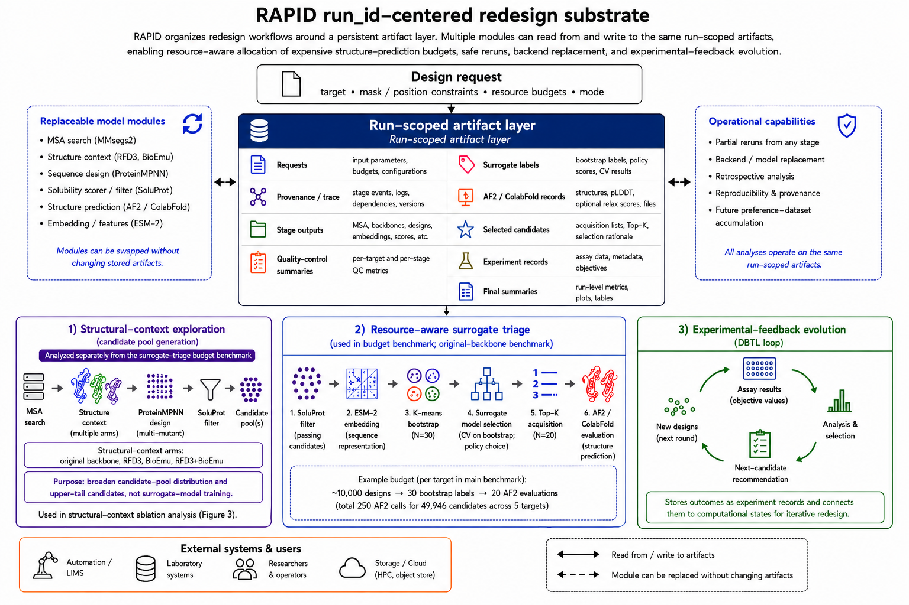
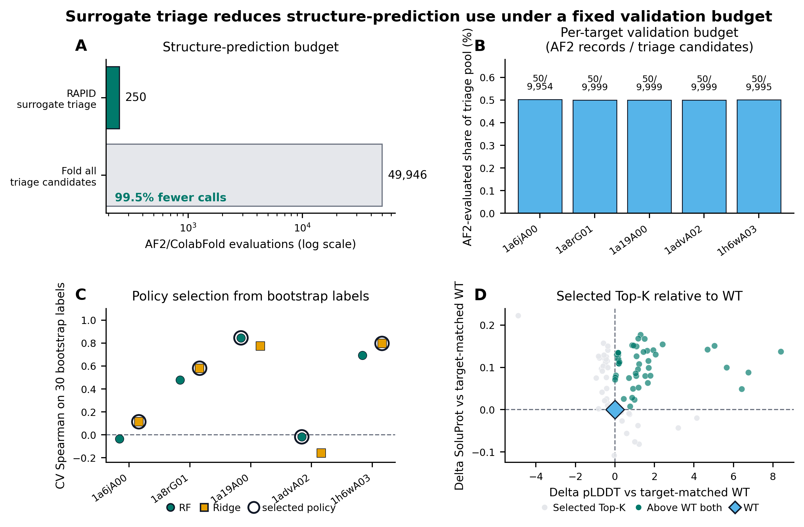
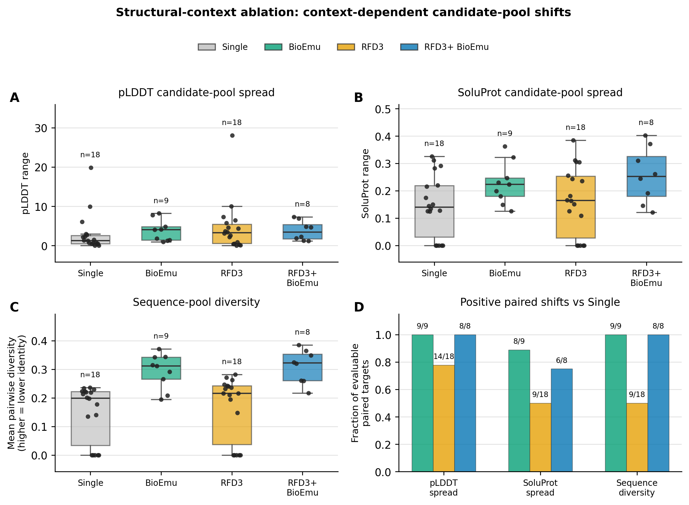

# RAPID: A Reproducible Pipeline for Solubility-Oriented Protein Redesign with Resource-Aware Surrogate Triage

## Abstract

Recent AI-enabled protein-design workflows can generate thousands of variants per target, but structure prediction, artifact management, and downstream candidate selection remain bottlenecks for reproducible redesign campaigns. We present RAPID, a run-scoped artifact pipeline for resource-aware, solubility-oriented multi-mutant redesign. RAPID integrates conservation-aware candidate generation, solubility scoring/filtering, optional structural-context expansion, and AF2/ColabFold evaluation under stable run identifiers, allowing reruns, benchmark reconstruction, and downstream analyses to operate on identical artifacts. To allocate expensive structure-prediction calls, RAPID uses a local ESM-2-based surrogate that is initialized from a deterministic, diversity-aware bootstrap and selected by internal cross-validation. Across a 77-target CATH corpus containing 9,206 paired SoluProt/pLDDT records, retrospective surrogate-family benchmarks support objective-specific acquisition choices, while a separate five-target operating benchmark uses a fixed budget of 50 AF2/ColabFold evaluations per target. An 18-target structural-context ablation shows that RFdiffusion-derived backbones (RFD3) and BioEmu primarily alter candidate-pool spread and sequence diversity rather than aggregate score uplift. RAPID therefore provides a reproducible artifact and compute-allocation layer for resource-aware, proxy-guided protein redesign campaigns.

## 1. Introduction

Computational protein redesign has become a multi-model workflow. A practical solubility-oriented campaign now combines sequence search, conservation-aware residue constraints, inverse-folding sequence design, soluble-expression filtering, structure prediction, and downstream developability analysis [1-8]. The scientific question is often not unconstrained protein generation, but constrained redesign: starting from an existing target or scaffold, the researcher wants a tractable library of multiple-mutant variants that preserves important positions, improves computational soluble-expression likelihood, and remains structurally plausible. This framing is consistent with earlier work showing that protein expression, stability, and solubility can be improved by structure- and sequence-aware computational design, while still requiring experimental validation for final biological claims [9,10].

This setting creates an infrastructure problem. Individual models are updated rapidly and often expose different input formats, output schemas, runtime assumptions, and failure modes. When campaigns are organized as scripts and notebooks, intermediate artifacts become difficult to audit, partial reruns become unsafe, and later model replacement can force a rewrite of the analysis code. These problems grow as redesign campaigns evaluate batches of candidate sequences across targets, masking policies, backbone contexts, and scoring thresholds, then connect computational candidates to follow-up measurements and design decisions. The resulting bottleneck is therefore both computational and interpretive: large candidate sets must be generated cheaply enough to be useful, but their provenance and outcome labels must also remain organized enough to support later analysis.

The dominant downstream cost in such workflows is structure prediction. ProteinMPNN can generate hundreds or thousands of variants per target, and SoluProt can score them cheaply, but running AF2/ColabFold for every SoluProt-passing sequence is rarely justified. The practical question is therefore not only how to generate candidates, but how to decide where expensive structure-prediction evaluations should be spent and how those decisions can be interpreted once experimental feedback becomes available. A useful platform should make this decision auditable: it should preserve the full path from input to candidate, allow stored results to support multiple analyses, record assay-derived objective values in a reusable form, and expose enough model-replacement structure that new backends can be tested without changing the scientific question.

We present RAPID, a reproducible artifact pipeline for resource-aware, solubility-oriented redesign. RAPID is a model-orchestration and artifact layer rather than a new predictive model or a universal protein-design engine. The study is organized around three contributions. First, RAPID converts fragmented model outputs into a reusable, model-replaceable artifact substrate. Second, RAPID implements and benchmarks structure-prediction-budgeted surrogate triage for post-SoluProt candidate selection in an isolated original-backbone benchmark. Third, RAPID evaluates structural-context allocation by comparing candidate pools generated from the original backbone, BioEmu, RFdiffusion-derived backbones (RFD3), and combined RFD3+BioEmu contexts under explicit design and AF2 budgets. Operationally, the surrogate-triage layer can be enabled after optional structural-context stages, but the reported fixed-budget triage benchmark keeps candidate-pool generation and compute allocation separate. RAPID also records assay outcomes and supports experimental-feedback evolution, providing a traceable path from computational shortlisting to prospective design-test-learn cycles.

## 2. Methods

### 2.1 Pipeline and Artifact Contract

RAPID represents each redesign campaign as a run-scoped orchestration record rather than as a collection of disconnected scripts. Its operational workflow connects MSA construction, optional RFD3 and BioEmu structural-context stages, ProteinMPNN design, SoluProt filtering, AF2/ColabFold evaluation, and downstream novelty reporting. MSA construction defines conservation-informed fixed-position constraints. ProteinMPNN generates multiple-mutant libraries under those constraints, SoluProt provides a low-cost soluble-expression filter, and AF2/ColabFold provides structural-confidence labels for selected candidates. pLDDT is used only as a computational shortlisting proxy, not as evidence of experimental stability or activity.

Each run stores its typed request, stage outputs, status records, trace events, quality-control summaries, experiment records, and final summaries under a stable run identifier. Downstream analyses consume shared artifact fields rather than model-specific folders, which is the basis for partial reruns, retrospective benchmark reconstruction, and backend replacement. The local browser interface exposes the same run identifiers and request fields as the backend, but the scientific claims are based on the stored artifacts rather than on the interface itself.

*Figure 1. RAPID run-scoped redesign workflow. A typed design request is written into a shared run-scoped artifact record that stores requests, stage outputs, QC summaries, AF2 labels, and assay records under a stable run identifier. Three subsystems consume and update this record: structural-context exploration, resource-aware surrogate triage, and experimental-feedback evolution. In the fixed-budget triage benchmark, RAPID uses approximately 10,000 designs per target, 30 bootstrap AF2/ColabFold labels, and 20 surrogate-acquired Top-K evaluations. Structural-context exploration is analyzed separately from surrogate triage to distinguish candidate-pool generation from compute allocation.*

### 2.2 Surrogate Triage and Experimental Evolution

RAPID separates two related uses of surrogates. The first is a computational structure-prediction-budgeted triage layer used in the benchmark. ProteinMPNN first generates a candidate pool across conservation tiers, and SoluProt scores every candidate. SoluProt-scored candidates passing the configured criteria are embedded with mean-pooled ESM-2 8M embeddings [4]. In deployment, this embedding stage can be backed by a GPU ESM worker, allowing large ProteinMPNN pools to be featurized without expanding the AF2/ColabFold acquisition budget. K-means selects a diverse bootstrap training set, AF2 labels those candidates, and local surrogate policies are compared by internal cross-validation on the labeled set. The selected acquisition policy is then refit on all bootstrap labels and used to rank the remaining SoluProt-scored pool; only that policy’s Top-K candidates are sent to AF2/ColabFold. The implemented comparators include Random Forest, Ridge, XGBoost, and LightGBM, with K-means used for bootstrap selection and Bayesian-optimization-inspired criteria used for acquisition ranking [13-18]. In the software, this triage layer is a switchable component after SoluProt and can be combined with optional upstream RFD3 or BioEmu stages. In the benchmark, it is evaluated on original-backbone candidate pools to isolate compute allocation from structural-context exploration. This mode is a compute-allocation policy for structure prediction, not evidence of experimental activity or expression.

The production triage default uses one shared budget across the selected 30%, 50%, and 70% conservation tiers. In the manuscript benchmark, this layer is evaluated with the original target backbone and without RFD3 or BioEmu-generated candidate pools so that the fixed-budget triage result is not conflated with structural-context expansion. By default, ProteinMPNN requests 3,333 candidates per tier, giving a nominal 9,999 designs before validation and SoluProt filtering. RAPID then labels 30 K-means-selected bootstrap candidates from the pooled SoluProt-scored set and evaluates 20 Top-K AF2 acquisitions from the same pooled set. The N = 30 bootstrap was chosen because the sample-size ablation reaches most of the observed Random Forest pLDDT uplift by that point, while Top-K = 20 fixes a target-level validation budget that is large enough for manual review but small enough to keep the AF2 cost explicit. RAPID compares surrogate policies on the same labeled bootstrap set and uses only one selected acquisition policy for the final Top-K. Detailed audit outputs are described in the supplement and release package.

The second use is an experimental-feedback evolution mode. In this mode, RAPID generates a SoluProt-gated candidate pool when no experimental labels are available. Users can later record assay outcomes through stable candidate or sequence identifiers, objective metrics, measurement directions, and replicate metadata. When labels for a specified objective metric are present, RAPID trains a local surrogate on the labeled sequences and writes a next-candidate recommendation table for the next design-test-learn cycle. This interface is related to active-learning directed-evolution frameworks such as EVOLVEpro, but the present manuscript treats it as an assay-feedback handoff rather than as a prospective experimental validation result [11]. A legacy AF2-oracle label source preserves the earlier computational comparison mode, but the default evolution label source is experimental feedback.

This separation is important because computational shortlisting and experimental evidence are different label sources. The surrogate-triage mode reduces how many candidates require expensive structure prediction before a shortlist is made, whereas experimental-feedback evolution defines how a shortlist can re-enter the system after expression, solubility, activity, or stability assays. Operationally, RAPID produces traceable shortlists and experiment-request records, while physical measurements are performed outside the software and re-enter RAPID only as labeled outcomes (see Supplementary Note 10 for an illustrative data-trace schema). This data pathway is intended to support future experimental evaluation rather than to serve as prospective validation in the present benchmark. The artifact contract allows a later campaign to ask whether a model, masking rule, or backbone context changed the distribution of candidates without manually reconstructing which files, scores, and assay records belonged to each decision.

### 2.3 Benchmark Analyses

The current stored artifact benchmark contains 9,206 paired SoluProt and pLDDT records from 77 QC-passing CATH runs in the corrected-chain refresh [12]. The refresh applies the corrected chain-selection contract introduced after the original archive and is used in the main text as component-level evidence for structure-prediction-budgeted surrogate triage rather than as a definitive population-level performance estimate. Runs with fallback sequences, invalid amino-acid records, missing conservation tiers, or insufficient paired SoluProt/pLDDT records were excluded. The full 115-run corrected-chain archive and QC details are reported in Supplementary Notes 1 and 2.

The primary surrogate-triage metrics are Spearman rank correlation, Top-K recall, and BO uplift Top-K. BO uplift measures the difference between the mean observed score of the surrogate-selected Top-K and the mean score of K random draws from the same held-out pool. Paired comparisons use Wilcoxon signed-rank tests with Holm correction, effect-size interpretation uses Cliff’s dominance statistic, and uncertainty is estimated by cluster bootstrap with target as the cluster [19-21]. Variance decomposition uses a one-way ANOVA intraclass correlation coefficient to estimate how much score variation is attributable to target identity [22].

The strict five-target surrogate-triage run used the original target backbone, disabled RFD3, BioEmu, and Relax, requested 3,333 ProteinMPNN candidates for each of the 30%, 50%, and 70% conservation tiers, used GPU-backed ESM embeddings, and disabled fallback sequence recovery. WT SoluProt and ColabFold baselines were then computed once per target as reference points for interpretation; these WT baseline calls were not used for surrogate training, Top-K acquisition, or the 250-candidate triage-budget count. Structural-context effects were analyzed separately in a corrected-chain 18-target ablation comparing the original target backbone, BioEmu conformational samples, a selected RFD3 backbone, and RFD3+BioEmu under matched design and AF2 budgets. BioEmu-containing arms were considered quantitatively evaluable only when the requested near-target conformers passed the fixed 2.0 Å target-RMSD gate. Detailed per-model, per-target, and QC tables are reported in the supplement.

## 3. Results

### 3.1 Reusable Artifact Substrate

The first result is operational: RAPID made heterogeneous model outputs reusable across analyses. In the current artifact benchmark, K-means versus random selection, surrogate-family comparison, sample-size ablation, rank-mean ensemble testing, acquisition-bias analysis, and variance decomposition were regenerated from the same 9,206 stored AF2/SoluProt records rather than from separately refolded datasets. This supports the artifact-contract claim without requiring RAPID to be interpreted as a new predictive model.

| Stored artifact             | Scope in current evidence                                                                     | Reused analyses or actions                                                                                            | Claim 1 interpretation                                                                                       |
|-----------------------------|-----------------------------------------------------------------------------------------------|-----------------------------------------------------------------------------------------------------------------------|--------------------------------------------------------------------------------------------------------------|
| Paired computational labels | 9,206 SoluProt/pLDDT records from 77 QC-passing CATH runs in the corrected-chain refresh      | Model comparison, sample-size ablation, rank-mean ensemble testing, acquisition-bias analysis, variance decomposition | Multiple analyses were regenerated from stored labels rather than from new AF2/ColabFold calls.              |
| Run-scoped provenance       | Typed request, stage outputs, status records, trace events, QC summaries, and final summaries | Partial reruns, failure review, benchmark reconstruction, public-release export                                       | The run ID acts as a provenance anchor instead of leaving each tool output as an isolated folder.            |
| Candidate identifiers       | Stable run, tier, sequence, and acquisition identifiers                                       | Links surrogate selection, AF2 records, exported shortlists, and later assay labels                                   | Computational candidates can be followed into downstream review and experimental-feedback records.           |
| Shared artifact fields      | Backend-independent score, path, policy, and QC fields consumed by benchmark scripts          | Structure-predictor, solubility-model, surrogate-policy, and relax-backend replacement tests                          | Model replacement changes the writer backend, while downstream analysis consumes the same artifact contract. |

*Table 1. Evidence for the reusable-artifact claim. The table reports the artifact fields reused across analyses, the scope of the current evidence, and why those records support provenance, rerun, and model-replacement claims rather than a new predictive-model claim.*

### 3.2 Surrogate-Triage Fixed-Budget Benchmark

The surrogate-triage result is a fixed-budget compute-allocation result rather than a biological enrichment result. RAPID applied one shared AF2/ColabFold validation budget per target: 30 K-means bootstrap labels and 20 surrogate-acquired Top-K candidates, totalling 50 AF2/ColabFold evaluations per target across the selected 30%, 50%, and 70% conservation tiers. The strict five-target run used the original target backbone, disabled RFD3, BioEmu, and Relax, and requested 3,333 ProteinMPNN candidates per tier. Across 49,946 pooled candidates entering triage, RAPID therefore evaluated 250 AF2/ColabFold records in total (150 bootstrap labels and 100 Top-K acquisitions across the five targets; per-target run and WT-reference details in Supplementary Note 8). This comparison is reported only as a fold-all accounting baseline, not as a model-performance claim. In these strict runs the pool entering triage was essentially the full validated ProteinMPNN set (9,954–9,999 candidates per target), so SoluProt acted as a ranking score rather than as a restrictive pass/fail gate at the thresholds used. The five-target run and the retrospective benchmark below play complementary roles: the former fixes the end-to-end operating point — how many AF2/ColabFold evaluations a real run actually spends — whereas the latter quantifies whether the surrogate's ranking recovers high-scoring candidates.

Surrogate acquisition quality was evaluated in a separate retrospective benchmark in which fully labeled held-out pools were available, allowing Top-K recall and BO uplift to be measured directly (Supplementary Note 4). With 30 K-means bootstrap labels, Ridge recovered 70.3% of the held-out top-5 SoluProt candidates compared with 5.1% for random ranking, while Random Forest improved pLDDT Top-5 recall relative to random ranking (13.1% versus 5.5%) and produced a mean pLDDT Top-5 BO uplift of 1.055. Because these comparisons are made within identical ProteinMPNN-generated held-out pools, the recall differences reflect the surrogate ranking step rather than differences in candidate-pool composition. This retrospective evidence supports allocating the fixed AF2/ColabFold budget to surrogate-selected Top-K candidates rather than to random selection.

Figure 2 summarizes the fixed-budget triage setting, the retrospective acquisition-quality evidence used to justify the surrogate layer, and the selected candidates relative to WT references. Panels A, C, and D use the strict five-target operating benchmark; panel B uses the separate 77-target fully labeled surrogate-family benchmark, because Top-5 recall requires the held-out pool to be labeled. Panel A shows that each target used approximately 0.5% of its triage pool for AF2/ColabFold evaluation, panel B that the surrogate recovers high-scoring candidates substantially above random selection, and panels C-D the internal Auto-CV policy decision and the selected Top-K candidates relative to a WT reference. In this visualization, each target’s selected Top-K set included at least one candidate above the WT baseline on both computational proxies, although the unselected pool was not fully evaluated. This should still be read as proxy-based shortlist evidence rather than a full-pool enrichment test: WT baselines were reference calls that did not enter the acquisition budget. Available fitted comparator artifacts are exported for audit, but they do not add AF2 calls unless the operator explicitly changes the validation budget.

*Figure 2. Surrogate-triage budget, acquisition quality, and selected candidates. Panels A, C, and D summarize the strict five-target fixed-budget operating benchmark, whereas panel B reports a separate retrospective 77-target fully labeled surrogate-family benchmark in which Top-5 recall can be measured. (A) In the strict benchmark setting, RAPID evaluates 250 AF2/ColabFold candidate records from 49,946 candidates entering triage, equivalent to evaluating 0.5% of the triage pool under a fold-all accounting baseline rather than a model-performance claim. (B) In the retrospective 77-target fully labeled CATH surrogate benchmark, Random Forest improves pLDDT Top-5 recall over random selection, whereas Ridge improves SoluProt Top-5 recall over random selection. This panel evaluates surrogate acquisition behavior and is separate from the strict five-target operating benchmark, where the unselected pool was not fully folded. (C) Auto-CV selects the acquisition policy from the 30 bootstrap labels; RF and Ridge are offset within each target, marker shape identifies the policy, and an open ring marks the selected policy used for final Top-K acquisition. (D) Each circle is one selected Top-K candidate from one target, plotted after subtracting that target’s WT pLDDT and SoluProt values; WT references are therefore aligned at the blue diamond at zero. Green points improve both computational proxies over WT, whereas grey points are other selected candidates. WT baselines were computed once per target for reference and were not included in the candidate triage-budget count.*

### 3.3 Structural-Context Exploration

The structural-context result is a separate candidate-pool-generation analysis rather than an extension of the five-target surrogate-budget result. The relevant question is not whether an alternative context improves the aggregate mean or the best-scoring candidate, but whether it changes the accessible candidate distribution under the same downstream budget. Target identity explained 98.8% of pLDDT variance and 96.8% of SoluProt variance in the stored benchmark, indicating that deeper sampling of one local pool is not the only relevant allocation problem. A single-backbone ProteinMPNN pool can concentrate candidates around one local geometry and may mask nearby alternatives; any downstream selector can only choose among candidates already generated in that context. In the corrected-chain ablation, alternative contexts did not provide a consistent mean-score or upper-tail advantage. Instead, BioEmu-containing evaluable arms increased pLDDT range and sequence-pool diversity in all nine evaluable paired BioEmu targets and in all eight evaluable paired RFD3+BioEmu targets (Wilcoxon p = 0.004 and p = 0.008, respectively). RFD3 increased pLDDT range in 14 of 18 paired targets (Wilcoxon p = 0.002) and produced a smaller but significant positive shift in sequence-pool diversity (positive in 9 of 18 targets, with significance driven by the magnitude of the positive shifts rather than their count; signed-rank p = 0.010); its support for SoluProt-spread shifts remained weaker than for BioEmu. RFD3 and BioEmu are therefore treated as controlled context-perturbation modules with explicit QC, not as default score boosters or as surrogate-model components. BioEmu also slightly but significantly lowered mean pLDDT (mean paired change of about -0.6 pLDDT, Wilcoxon p = 0.04) without increasing the upper tail (max pLDDT p = 1.0), consistent with a diversity-for-mean trade-off rather than an aggregate quality gain.

*Figure 3. Structural-context ablation as context-dependent candidate-pool shifts. Panels A-C show absolute target-level distributions for pLDDT range, SoluProt range, and mean pairwise diversity across the single-backbone, BioEmu, RFD3, and RFD3+BioEmu arms. Points are targets and boxes summarize target distributions; the label above each arm reports the number of evaluable targets. Higher mean pairwise diversity indicates lower sequence similarity within the candidate pool. Panel D reports positive paired shifts relative to the single-backbone arm, with bar labels showing positive paired targets over evaluable paired targets. Single-backbone and RFD3 arms were evaluable for all 18 selected CATH targets, whereas BioEmu was quantitatively evaluable for nine targets and RFD3+BioEmu for eight targets — those that passed the fixed 2.0 Å target-RMSD gate. The result supports structural-context sensitivity and diversity shifts rather than a universal upper-tail score improvement. Detailed structural-context and BioEmu QC tables are reported in the supplement.*

## 4. Discussion

RAPID addresses a practical bottleneck in AI-enabled protein redesign: how to preserve reusable artifacts and allocate expensive structure-prediction evaluations across large candidate pools. Its contribution is not a new protein-design model, but a run-scoped orchestration layer that makes model composition, artifact reuse, and retrospective analysis practical for solubility-aware redesign. By storing typed artifacts under stable run identifiers, RAPID turns expensive model calls into reusable data that can support new analyses without repeating the compute.

This artifact contract has workflow-scale consequences. In the present benchmark, multiple surrogate, selection-size, diversity, and variance analyses were regenerated from the same 9,206 paired SoluProt/pLDDT records rather than from separately refolded datasets. In the strict surrogate-budget runs, thousands of SoluProt-scored candidates were reduced to tens of AF2/ColabFold evaluations while preserving the candidate identifiers needed for downstream review. These examples do not establish experimental performance, but they show that large computational batches can become reusable decision context rather than disposable model-output folders.

The surrogate-triage result is similarly bounded. The evidence supports a structure-prediction allocation policy, not an experimental hit-rate claim. K-means provides a deterministic and diversity-aware cold-start bootstrap, Random Forest acts as a conservative pLDDT acquisition reference, Ridge is useful for SoluProt-oriented ranking, and N = 30 is a cost-efficient bootstrap point. RAPID uses these observations to define comparator policies, then selects one acquisition policy by internal cross-validation for each run. The retrospective pooled-scaling guardrail (Supplementary Note 9) shows that simple pooled accumulation without target conditioning does not monotonically improve ranking performance, supporting the current default of lightweight per-run calibration rather than premature replacement by a global surrogate.

A likely reason for this guardrail is target heterogeneity. Sequence length, fold class, disorder or low-complexity propensity, MSA depth, conservation pattern, and backbone context can all change how sequence edits map to pLDDT or soluble-expression proxies. A pooled model trained before these factors are explicitly conditioned may therefore learn target-level offsets or context-specific noise rather than a transferable acquisition rule. The same logic applies to diversity: the observed acquisition bias (Supplementary Note 6) suggests that future policies should combine predicted quality with explicit ESM-space diversity constraints, such as max-min filtering, cluster-balanced Top-K selection, or determinantal point processes, instead of relying on score ranking alone [23]. In this view, RAPID’s longer-term role is to accumulate AF2 labels, assay labels, paired rankings, target metadata, structural context, conservation tiers, and sequence-edit histories into a preference dataset that can later support target-conditioned models.

The structural-context result reframes backbone and ensemble stages as context-sensitivity probes. Target identity dominates the stored benchmark, and the corrected-chain structural-context ablation shows target-dependent tradeoffs under matched AF2 caps. A single-backbone ProteinMPNN pool can overrepresent sequences compatible with one local geometry; downstream triage can rank that local neighborhood efficiently but cannot recover candidates that were never generated. The useful signal is therefore the paired change in score spread and sequence diversity, not an aggregate claim that one structural-context module improves quality. RFD3 broadened pLDDT spread in most paired targets, whereas BioEmu-containing evaluable arms increased both pLDDT range and sequence-pool diversity in every evaluable paired target. This pattern supports treating RFD3 and BioEmu as controlled exploration modules with explicit QC rather than as default score-improvement modules.

The model-replacement claim is architectural but testable. RAPID can swap a structure predictor, inverse-folding model, solubility model, or relax backend when the replacement writes the same artifact fields. The numerical operating point should be re-estimated after such a replacement, but the downstream analysis workflow does not need to be redesigned. The surrogate-triage layer follows the same principle: it is refit per run on bootstrap labels from the configured backend, and the acquisition policy is selected by internal cross-validation on those labels. Ranking quality is therefore not assumed to be invariant across backends. If a replacement produces labels poorly predicted by the current feature space, the internal cross-validation rank correlation provides a diagnostic signal, and acquisition can fall back to diverse or random selection within the same budget. Strong cross-predictor performance claims would still require benchmarking against each new backend.

## 5. Limitations

The current evidence is computational and proxy-based. pLDDT and SoluProt scores do not establish soluble expression, thermodynamic stability, or activity without experimental validation. The experimental-feedback evolution interface can ingest assay labels and recommend the next candidate set, but no prospective experimental enrichment result is claimed here. RAPID should therefore be interpreted as a reproducible artifact and compute-allocation layer for proxy-guided redesign, not as evidence that the selected candidates have been experimentally validated.

The current surrogate-triage benchmark is based on a 77-target QC-passing artifact set from the corrected-chain CATH refresh, so it should be interpreted as component-level evidence for an AF2/ColabFold triage workflow rather than as a definitive population-level performance estimate. The completed archive was sufficient to test pooled surrogate accumulation, but not to show a stable pooled-model advantage over target-specific calibration; we therefore treat this result as support for the current per-run adaptive default and as motivation for future preference-dataset accumulation. The corrected-chain structural-context ablation covers 18 targets, with BioEmu quantitatively evaluable for nine targets and RFD3+BioEmu for eight under the fixed RMSD gate. This is sufficient to test structural-context allocation as a workflow variable, but not to claim a universal advantage for RFD3, BioEmu, or their combination.

## 6. Conclusion

RAPID provides a run-scoped artifact layer for resource-aware, solubility-oriented protein redesign. By preserving typed requests, model outputs, quality-control records, candidate identifiers, and assay-feedback records under stable run identifiers, RAPID allows heterogeneous model modules to be rerun, replaced, and analyzed without rebuilding the workflow around each backend. On top of this artifact substrate, the surrogate-triage mode allocates AF2/ColabFold evaluations to a small, auditable Top-K subset after SoluProt scoring, while preserving comparator-model evidence for review.

The present evaluation supports RAPID as a reproducible artifact and compute-allocation framework rather than as an experimentally validated design model. RAPID makes fragmented model outputs reusable, reduces structure-prediction calls under an explicit triage budget, and makes structural-context allocation testable across single-backbone, BioEmu, RFD3, and combined contexts. Its longer-term value is the reusable learning substrate created as computational labels, assay labels, target metadata, and structural-context decisions accumulate under the same artifact contract. Although the present study focuses on solubility-oriented redesign, the same triage pattern can be extended to other objectives when suitable low-cost proxies and prospective validation assays are available.

## Code, Data, and Software Availability

The public-release package includes the RAPID backend/MCP service under `pipeline-mcp/`, the static browser interface under `frontend/`, benchmark scripts under `scripts/benchmark/`, generated figures under `figures/benchmark/`, tabular results under `public_data/benchmark/results/`, and representative 3RGK/1LVM execution summaries under `public_data/case_studies/`. The corrected-chain manuscript refresh manifest is stored as `public_data/benchmark/results/rapid_target_manifest.csv`. The strict five-target surrogate-triage budget data are stored in tier-level, target-level, CV-metric, acquired-Top-K, and WT-reference views under `public_data/benchmark/results/`, with the composite budget figure under `figures/benchmark/fig2_surrogate_triage_budget.png` and the corresponding TeX budget table under `figures/benchmark/table5_surrogate_triage_budget.tex`. Runtime `.env` files, endpoint IDs, API keys, and logs are excluded. Large CATH and run-output archives are not committed to this source tree; they will be made available as an archived dataset (Zenodo release or S3-backed artifact; DOI to be added) upon publication.

## References

[1] Dauparas, J., Anishchenko, I., Bennett, N., et al. (2022). Robust deep learning-based protein sequence design using ProteinMPNN. *Science*. doi:10.1126/science.add2187

[2] Jumper, J., Evans, R., Pritzel, A., et al. (2021). Highly accurate protein structure prediction with AlphaFold. *Nature*. doi:10.1038/s41586-021-03819-2

[3] Mirdita, M., Schutze, K., Moriwaki, Y., Heo, L., Ovchinnikov, S., & Steinegger, M. (2022). ColabFold: making protein folding accessible to all. *Nature Methods*. doi:10.1038/s41592-022-01488-1

[4] Lin, Z., Akin, H., Rao, R., et al. (2023). Evolutionary-scale prediction of atomic-level protein structure with a language model. *Science*. doi:10.1126/science.ade2574

[5] Watson, J. L., Juergens, D., Bennett, N. R., et al. (2023). De novo design of protein structure and function with RFdiffusion. *Nature*. doi:10.1038/s41586-023-06415-8

[6] Lewis, S., Hempel, T., Jimenez-Luna, J., et al. (2025). Scalable emulation of protein equilibrium ensembles with generative deep learning. *Science*. doi:10.1126/science.adv9817

[7] Hon, J., Marusiak, M., Martinek, T., Kunka, A., Zendulka, J., Bednar, D., & Damborsky, J. (2021). SoluProt: prediction of soluble protein expression in *Escherichia coli*. *Bioinformatics*. doi:10.1093/bioinformatics/btaa1102

[8] Steinegger, M., & Soding, J. (2017). MMseqs2 enables sensitive protein sequence searching for the analysis of massive data sets. *Nature Biotechnology*. doi:10.1038/nbt.3988

[9] Goldenzweig, A., Goldsmith, M., Hill, S. E., et al. (2016). Automated structure- and sequence-based design of proteins for high bacterial expression and stability. *Molecular Cell*. doi:10.1016/j.molcel.2016.06.012

[10] Kosugi, T., & Ohue, M. (2022). Solubility-Aware Protein Binding Peptide Design Using AlphaFold. *Biomedicines*. doi:10.3390/biomedicines10071626

[11] Jiang, K., Yan, Z., Di Bernardo, M., et al. (2025). Rapid in silico directed evolution by a protein language model with EVOLVEpro. *Science*. doi:10.1126/science.adr6006

[12] Sillitoe, I., Bordin, N., Dawson, N., et al. (2021). CATH: increased structural coverage of functional space. *Nucleic Acids Research*. doi:10.1093/nar/gkaa1079

[13] Breiman, L. (2001). Random Forests. *Machine Learning*. doi:10.1023/A:1010933404324

[14] Chen, T., & Guestrin, C. (2016). XGBoost: A Scalable Tree Boosting System. *Proceedings of the 22nd ACM SIGKDD International Conference on Knowledge Discovery and Data Mining*. doi:10.1145/2939672.2939785

[15] Ke, G., Meng, Q., Finley, T., Wang, T., Chen, W., Ma, W., Ye, Q., & Liu, T.-Y. (2017). LightGBM: A Highly Efficient Gradient Boosting Decision Tree. *Advances in Neural Information Processing Systems 30*. https://papers.nips.cc/paper/6907-lightgbm-a-highly-efficient-gradient-boosting-decision-tree

[16] Pedregosa, F., Varoquaux, G., Gramfort, A., et al. (2011). Scikit-learn: Machine Learning in Python. *Journal of Machine Learning Research*. https://www.jmlr.org/papers/v12/pedregosa11a.html

[17] Arthur, D., & Vassilvitskii, S. (2007). k-means++: The Advantages of Careful Seeding. *Proceedings of the Eighteenth Annual ACM-SIAM Symposium on Discrete Algorithms*. https://dl.acm.org/doi/10.5555/1283383.1283494

[18] Shahriari, B., Swersky, K., Wang, Z., Adams, R. P., & de Freitas, N. (2016). Taking the Human Out of the Loop: A Review of Bayesian Optimization. *Proceedings of the IEEE*. doi:10.1109/JPROC.2015.2494218

[19] Wilcoxon, F. (1945). Individual Comparisons by Ranking Methods. *Biometrics Bulletin*, 1(6), 80-83. doi:10.2307/3001968

[20] Holm, S. (1979). A Simple Sequentially Rejective Multiple Test Procedure. *Scandinavian Journal of Statistics*, 6(2), 65-70. https://www.jstor.org/stable/4615733

[21] Cliff, N. (1993). Dominance statistics: Ordinal analyses to answer ordinal questions. *Psychological Bulletin*. doi:10.1037/0033-2909.114.3.494

[22] Shrout, P. E., & Fleiss, J. L. (1979). Intraclass correlations: Uses in assessing rater reliability. *Psychological Bulletin*. doi:10.1037/0033-2909.86.2.420

[23] Kulesza, A., & Taskar, B. (2012). Determinantal Point Processes for Machine Learning. *Foundations and Trends in Machine Learning*, 5(2-3), 123-286. doi:10.1561/2200000044
