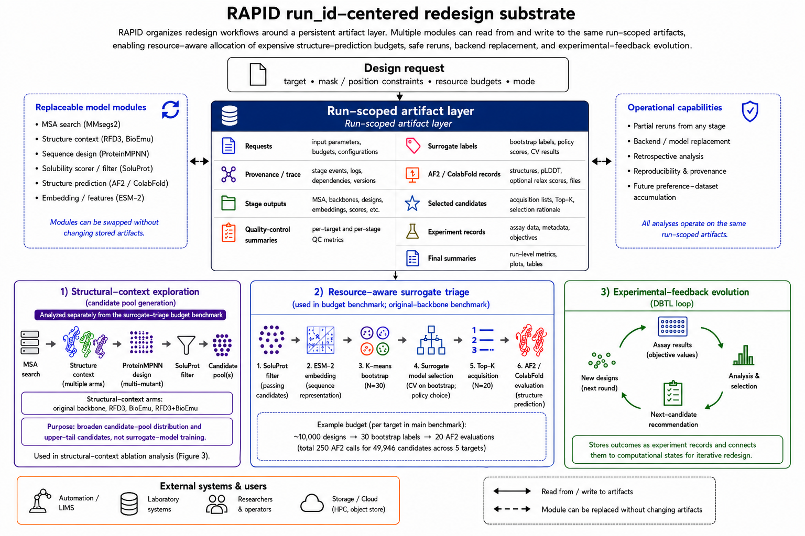
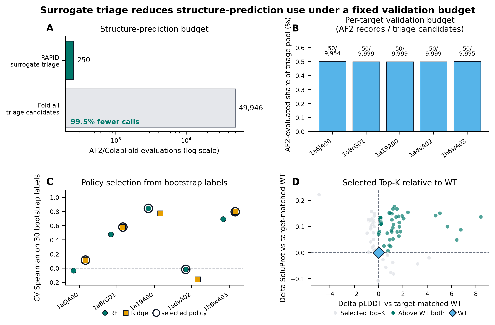
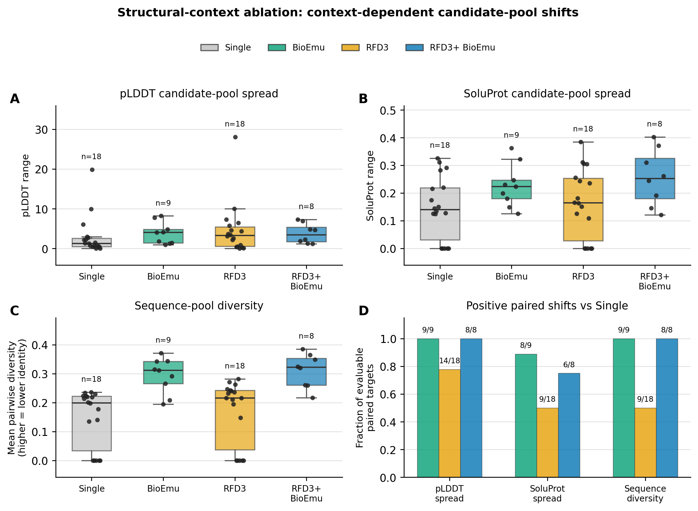
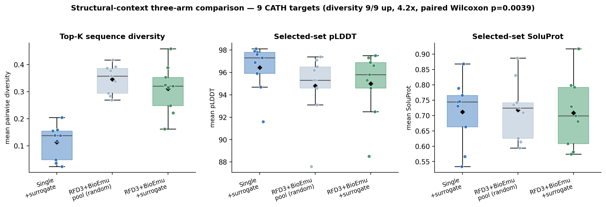
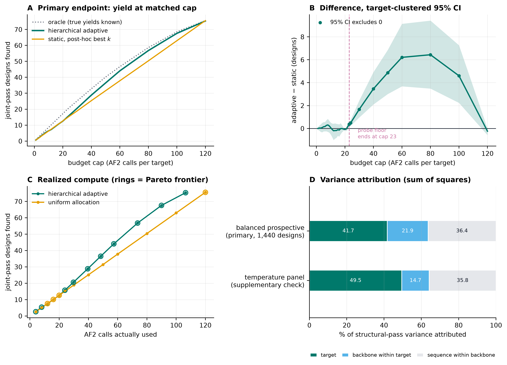

# RAPID: Resource-Aware, Artifact-Preserving Orchestration for Solubility-Oriented Protein Redesign

Yaeseong Park 1, \*

1 Korea Research Institute of Bioscience and Biotechnology (KRIBB), Daejeon, Republic of Korea

\* Corresponding author: Yaeseong Park, Korea Research Institute of Bioscience and Biotechnology (KRIBB), Daejeon, Republic of Korea. ORCID 0009-0004-5318-2423. Email: [corresponding-author email to be provided before submission].

## Abstract

Recent AI-enabled protein-design workflows can generate thousands of variants per target, but their component models differ in input formats, runtime assumptions, and failure modes, and structure prediction for every candidate is often computationally impractical. We present RAPID, an orchestration-and-artifact platform for resource-aware, solubility-oriented protein redesign. RAPID executes a typed redesign request through modular tools for MSA search, inverse-folding sequence design, solubility scoring, optional structural-context generation, and AF2/ColabFold evaluation -- exposed through a standard tool interface (the Model Context Protocol, MCP) -- while recording each request, stage output, quality-control decision, and label under a stable run identifier. To allocate expensive structure-prediction calls, RAPID uses a local ESM-2-based surrogate triage layer: a deterministic diversity-aware bootstrap is labeled, candidate acquisition policies are compared by internal cross-validation, and only a selected Top-K subset is folded. In a 77-target CATH retrospective benchmark with 9,206 paired SoluProt/pLDDT records, surrogate ranking recovered high-scoring candidates substantially above random selection, with Ridge recovering 70.3% of held-out top-5 SoluProt-ranked candidates versus 5.1% for random ranking. In a separate five-target strict operating benchmark, RAPID held the AF2/ColabFold budget to 50 evaluations per target, corresponding to 0.5% of candidates under a fold-all accounting baseline. A separate 18-target structural-context ablation showed that BioEmu-containing structural-context arms primarily changed candidate-pool spread and sequence diversity rather than providing a universal aggregate score uplift. In a prospective holdout of twelve CATH targets never previously run, all 1,728 folds of a balanced 12 x 6 x 24 grid completed, and 41.7% / 21.9% / 36.4% of structural-pass variance was attributable to target, backbone-within-target, and sequence-within-backbone levels respectively. Under a pre-registered analysis plan, a hierarchical adaptive allocation policy that chooses which backbone receives the next structure-prediction call found more passing designs than post-hoc-best static allocation at matched budget caps from 23 calls per target upward (+3.46 [2.10, 4.92] designs at a cap of 40), with no benefit below that point because a mandatory per-backbone probe consumes the budget. RAPID therefore provides a reproducible orchestration, compute-allocation, and provenance layer for proxy-guided protein redesign, while leaving experimental validation to downstream assay feedback.

## 1. Introduction

Computational protein redesign has become a multi-model workflow. A practical solubility-oriented campaign now combines conservation-aware residue constraints with inverse-folding sequence design [1], structure prediction [2,3], optional structural-context generation with RFdiffusion- or ensemble-based methods [4,5], soluble-expression scoring [6], and sequence search [7]. The scientific question is often not unconstrained protein generation, but constrained redesign: starting from an existing target or scaffold, the researcher wants a tractable library of multiple-mutant variants that preserves important positions, improves computational soluble-expression likelihood, and remains structurally plausible. This framing is consistent with earlier work showing that protein expression, stability, and solubility can be improved by structure- and sequence-aware computational design, while still requiring experimental validation for final biological claims [8,9].

This setting creates an infrastructure problem. Individual models are updated rapidly and often expose different input formats, output schemas, runtime assumptions, and failure modes. When campaigns are organized as scripts and notebooks, intermediate artifacts become difficult to audit, partial reruns become unsafe, and later model replacement can force a rewrite of the analysis code. These problems grow as redesign campaigns evaluate batches of candidate sequences across targets, masking policies, backbone contexts, and scoring thresholds, then connect computational candidates to follow-up measurements and design decisions. The resulting bottleneck is therefore both computational and interpretive: large candidate sets must be generated cheaply enough to be useful, but their provenance and outcome labels must also remain organized enough to support later analysis.

The dominant downstream cost in such workflows is structure prediction. ProteinMPNN can generate hundreds or thousands of variants per target, and SoluProt can score them cheaply, but running AF2/ColabFold for every SoluProt-scored candidate is rarely justified. The practical question is therefore not only how to generate candidates, but how to decide where expensive structure-prediction evaluations should be spent and how those decisions can be interpreted once experimental feedback becomes available. A useful platform should make this decision auditable: it should preserve the full path from input to candidate, allow stored results to support multiple analyses, record assay-derived objective values in a reusable form, and expose enough model-replacement structure that new backends can be tested without changing the scientific question.

We present RAPID, an orchestration-and-artifact platform for resource-aware, solubility-oriented redesign. RAPID is a model-orchestration layer rather than a new predictive model or a universal protein-design engine: a single request is interpreted and executed by an orchestrator that dispatches modular model tools through a standard tool interface (the Model Context Protocol, MCP [10]), with stage sequencing, rule-based quality control, and recovery handling. The study is organized around three contributions. First, RAPID provides a command-driven orchestration layer that runs heterogeneous, independently-updated models behind one interface, so backends can be added or replaced without changing the scientific question. Second, on top of this layer RAPID implements and benchmarks resource-aware surrogate triage for post-SoluProt candidate selection, concentrating a fixed structure-prediction budget on a surrogate-ranked Top-K. Third, RAPID evaluates structural-context allocation by comparing candidate pools generated from the original backbone, BioEmu, RFdiffusion3 (RFD3) [11], and combined RFD3+BioEmu contexts under explicit design and AF2 budgets. Underpinning all three, every request, tool call, output, and label is written to a single run-scoped artifact record, so reruns, benchmark reconstruction, and assay-feedback evolution operate on identical artifacts.

RAPID's contribution is an orchestration-and-artifact layer rather than a new model, so it sits alongside two bodies of prior work. General workflow managers such as Nextflow [12] and Snakemake [13], and experiment-tracking tools such as MLflow [14], provide reproducible execution and data lineage but are not specialized for protein-redesign artifacts or for budgeting structure-prediction calls; domain frameworks such as BioNeMo [15] bundle protein models without a run-scoped artifact contract or a surrogate-triage budget. Relative to active-learning directed-evolution methods such as EVOLVEpro [16] and earlier solubility- and stability-oriented design work [8,9], RAPID adds a typed run-scoped artifact contract that makes heterogeneous model outputs reusable across analyses, together with an explicit fixed-budget surrogate-triage policy for allocating expensive AF2/ColabFold calls.

## 2. Methods

### 2.1 Pipeline and Artifact Contract

RAPID represents each redesign campaign as a run-scoped orchestration record rather than as a collection of disconnected scripts. Its operational workflow connects multiple-sequence-alignment (MSA) construction, optional RFD3 and BioEmu structural-context stages, ProteinMPNN design, SoluProt scoring/filtering, AF2/ColabFold evaluation, and downstream novelty reporting. MSA construction defines conservation-informed fixed-position constraints. ProteinMPNN generates multiple-mutant libraries under those constraints, SoluProt provides a low-cost soluble-expression score/filter, and AF2/ColabFold provides structural-confidence labels for selected candidates. The AlphaFold predicted local-distance difference test (pLDDT) is used only as a computational shortlisting proxy, not as evidence of experimental stability or activity.

Each run stores its typed request, stage outputs, status records, trace events, quality-control summaries, experiment records, and final summaries under a stable run identifier. Downstream analyses consume shared artifact fields rather than model-specific folders, which is the basis for partial reruns, retrospective benchmark reconstruction, and backend replacement. The local browser interface exposes the same run identifiers and request fields as the backend, but the scientific claims are based on the stored artifacts rather than on the interface itself.

Orchestration is exposed through a Model Context Protocol (MCP [10]) tool interface. A typed request -- target sequence or structure, conservation masks and position constraints, a resource budget, and a mode -- is submitted to named tools (pipeline.run, pipeline.preflight, pipeline.classify_residues, pipeline.af2_predict, pipeline.diffdock, and the feedback, experiment, and agent-event accessors), and the orchestrator sequences the stages deterministically (rule-based control, not an LLM agent), dispatching internal and external GPU services behind the same interface. Two quality-control mechanisms operate over this layer. First, an evidence-agent panel runs rule-based structure, protein, ligand, and experimental checks at each stage and records a consensus decision (proceed or recover) to a per-run agent-panel log. Second, stage-level automatic recovery substitutes a defined fallback when a backend stage fails or returns unusable output -- for example, reverting to the original target backbone when an RFD3 request fails -- and records the substitution in the run record. This stage-level recovery is distinct from the per-design ProteinMPNN fallback-sequence recovery, which is disabled in the reported benchmarks so that every reported design originates from the configured backend.

*Figure 1. RAPID is an orchestration-driven redesign platform. A single request (target, masks/position constraints, resource budget, mode) enters through the orchestration + MCP layer, which interprets the command and dispatches modular model tools (MMseqs2 MSA search, RFD3, BioEmu, ProteinMPNN, SoluProt, and AF2/ColabFold) through a standard interface with stage sequencing, rule-based QC, and recovery handling. A resource-aware surrogate triage then ranks the full design pool so that only a Top-K subset spends an AF2/ColabFold call, corresponding in the strict benchmark to evaluating about 0.5% of candidates under a fold-all accounting baseline. Ranked candidates are returned, assay outcomes feed the next round, and every step is written to a single run-scoped artifact record.*

Software and model versions used in the benchmark are: ESM-2 (esm2_t6_8M_UR50D) for embeddings; ProteinMPNN (weights v_48_020) for design; ColabFold 1.6.1 (colabfold_batch; AlphaFold2 weights, model_type alphafold2_ptm for monomers and alphafold2_multimer_v3 for multimers) run with its defaults of five models and three recycles and without Amber relaxation; MMseqs2 18-8cc5c for MSA; SoluProt (model global_soluprot_v1) with a default pass threshold of 0.5; the legacy RFdiffusion backbone backend (RFdiffusion v1.1.0 [4]); the RFD3 backbone backend, which is RFdiffusion3 [11] (rc-foundry 0.1.12, atomworks 2.2.0, checkpoint rfd3_foundry_2025_12_01_remapped.ckpt, served by the pinned rc-foundry 0.1.12 / atomworks 2.2.0 endpoint); BioEmu 1.3.1 for conformational sampling; Rosetta FastRelax (release 2025.37, REF2015 score function) for the optional relax stage; and scikit-learn (\>=1.3.0) for the surrogate models. Because the benchmark disables the Relax stage, AF2/ColabFold pLDDT and the target-RMSD gate are computed on unrelaxed coordinates. Exact per-run inference settings (model counts, recycles, sampling temperatures, RFD3 timesteps) are recorded in the artifact record.

### 2.2 Surrogate Triage and Experimental Evolution

RAPID separates two related uses of surrogates. The first is a computational structure-prediction-budgeted triage layer used in the benchmark. ProteinMPNN first generates a candidate pool across conservation tiers, and SoluProt scores every candidate. SoluProt-scored candidates passing the configured criteria are embedded with mean-pooled ESM-2 8M embeddings [17]. In deployment, this embedding stage can be backed by a GPU ESM worker, allowing large ProteinMPNN pools to be featurized without expanding the AF2/ColabFold acquisition budget. The smallest ESM-2 model (8M parameters) was chosen deliberately so that the full multi-thousand-candidate pool can be featurized in real time on modest GPU resources, consistent with the resource-aware goal of reducing the dominant AF2/ColabFold cost rather than maximizing embedding capacity; larger ESM-2 backends can be substituted under the same artifact contract, and an embedding-size sensitivity analysis (8M versus 150M, Supplementary Note 3) confirms that the larger model does not materially improve the budget-governing acquisition metrics, so the 8M model is retained as the resource-aware default. K-means selects a diverse bootstrap training set, AF2 labels those candidates, and local surrogate policies are compared by internal cross-validation on the labeled set. The selected acquisition policy is then refit on all bootstrap labels and used to rank the remaining SoluProt-scored pool; only that policy’s Top-K candidates are sent to AF2/ColabFold. The implemented comparators include Random Forest, Ridge, XGBoost, and LightGBM, with K-means used for bootstrap selection and Bayesian-optimization-inspired criteria used for acquisition ranking [18-23]. In the software, this triage layer is a switchable component after SoluProt and can be combined with optional upstream RFD3 or BioEmu stages. In the benchmark, it is evaluated on original-backbone candidate pools to isolate compute allocation from structural-context exploration.

The production triage default uses one shared budget across the selected 30%, 50%, and 70% conservation tiers. In the manuscript benchmark, this layer is evaluated with the original target backbone and without RFD3 or BioEmu-generated candidate pools so that the fixed-budget triage result is not conflated with structural-context expansion. By default, ProteinMPNN requests 3,333 candidates per tier, giving a nominal 9,999 designs before validation and SoluProt filtering. RAPID then labels 30 K-means-selected bootstrap candidates from the pooled SoluProt-scored set and evaluates 20 Top-K AF2 acquisitions from the same pooled set. The N = 30 bootstrap was chosen because the sample-size ablation reaches most of the observed Random Forest pLDDT uplift by that point, while Top-K = 20 fixes a target-level validation budget that is large enough for manual review but small enough to keep the AF2 cost explicit. RAPID compares surrogate policies on the same labeled bootstrap set and uses only one selected acquisition policy for the final Top-K. Detailed audit outputs are described in the supplement and release package.

The second use is an experimental-feedback evolution mode. In this mode, RAPID generates a SoluProt-scored candidate pool when no experimental labels are available. Users can later record assay outcomes through stable candidate or sequence identifiers, objective metrics, measurement directions, and replicate metadata. When labels for a specified objective metric are present, RAPID trains a local surrogate on the labeled sequences and writes a next-candidate recommendation table for the next design-test-learn cycle. This interface is related to active-learning directed-evolution frameworks such as EVOLVEpro, but the present manuscript treats it as an assay-feedback handoff rather than as a prospective experimental validation result [16]. A legacy AF2-oracle label source preserves the earlier computational comparison mode, but the default evolution label source is experimental feedback.

This separation is important because computational shortlisting and experimental evidence are different label sources. The surrogate-triage mode reduces how many candidates require expensive structure prediction before a shortlist is made, whereas experimental-feedback evolution defines how a shortlist can re-enter the system after expression, solubility, activity, or stability assays. Operationally, RAPID produces traceable shortlists and experiment-request records, while physical measurements are performed outside the software and re-enter RAPID only as labeled outcomes (see Supplementary Note 11 for an illustrative data-trace schema). This data pathway is intended to support future experimental evaluation rather than to serve as prospective validation in the present benchmark. The artifact contract allows a later campaign to ask whether a model, masking rule, or backbone context changed the distribution of candidates without manually reconstructing which files, scores, and assay records belonged to each decision.

### 2.3 Benchmark Analyses

The current stored artifact benchmark contains 9,206 paired SoluProt and pLDDT records from 77 QC-passing CATH runs in the corrected-chain refresh [24]. The refresh applies the corrected chain-selection contract introduced after the original archive and is used in the main text as component-level evidence for structure-prediction-budgeted surrogate triage rather than as a definitive population-level performance estimate. Runs with fallback sequences, invalid amino-acid records, missing conservation tiers, or insufficient paired SoluProt/pLDDT records were excluded. The full 115-run corrected-chain archive and QC details are reported in Supplementary Notes 1 and 2.

The primary surrogate-triage metrics are Spearman rank correlation, Top-K recall, and Bayesian-optimization (BO) uplift Top-K. BO uplift measures the difference between the mean observed score of the surrogate-selected Top-K and the mean score of K random draws from the same held-out pool. Paired comparisons use Wilcoxon signed-rank tests with Holm correction, effect-size interpretation uses Cliff’s dominance statistic, and uncertainty is estimated by cluster bootstrap with target as the cluster [25-27]. Variance decomposition uses a one-way ANOVA intraclass correlation coefficient (ICC(1,1)) to estimate how much score variation is attributable to target identity [28]. All stochastic steps use fixed random seeds (K-means initialization via k-means++, surrogate model fitting, and the target-clustered bootstrap); the acquisition-bias analysis is additionally repeated over five seeds (7, 42, 123, 2024, 31337) to confirm the reported effects are seed-stable (Supplementary Note 7).

The strict five-target surrogate-triage run used the original target backbone, disabled RFD3, BioEmu, and Relax, requested 3,333 ProteinMPNN candidates for each of the 30%, 50%, and 70% conservation tiers, used GPU-backed ESM embeddings, and disabled fallback sequence recovery. Wild-type (WT) SoluProt and ColabFold baselines were then computed once per target as reference points for interpretation; these WT baseline calls were not used for surrogate training, Top-K acquisition, or the 250-candidate triage-budget count. Structural-context effects were analyzed separately in a corrected-chain 18-target ablation comparing the original target backbone, BioEmu conformational samples, a selected RFD3 backbone, and RFD3+BioEmu under matched design and AF2 budgets. BioEmu-containing arms were considered quantitatively evaluable only when the requested near-target conformers passed the fixed 2.0 Å target-RMSD gate. As a directional corroboration of the selected-set diversity result, a separate five-enzyme monomer panel (IsPETase, DhaA, TEV protease, CALB, and HRP-C) was analyzed with the same single-backbone, RFD3+BioEmu pool, and RFD3+BioEmu surrogate-selected comparison used in Supplementary Note 14; this panel was not treated as an independently powered significance test. Detailed per-model, per-target, and QC tables are reported in the supplement.

### 2.4 Prospective Allocation Holdout

The allocation analyses in Section 3.4 use a separate prospective holdout rather than the stored retrospective benchmark. Twelve CATH targets were selected before any folding, four from each of three length strata (50-150, 150-250, 250-400 residues), using only structural eligibility and length; no yield information existed for these targets because they had never been run through the pipeline. The target list, the substitution rule for targets whose backbone generation failed, and the reserve ordering were frozen and committed before generation began. For each target, one native backbone and five RFD3 backbones passing the fixed 2.0 A target-RMSD acceptance gate were carried forward, and 24 ProteinMPNN sequences were generated per backbone at a single temperature (T = 0.1), giving 12 x 6 x 24 = 1,728 AF2/ColabFold folds. All 1,728 completed. The RFD3-only subset (12 x 5 x 24 = 1,440) is fully balanced with structure source held constant and is used as the primary cohort; the native backbones enter only as a sensitivity analysis, because one native backbone per target makes backbone-level comparison unbalanced.

Structural agreement uses a frozen metric: sequence-order correspondence between design and reference, non-loop CA atoms selected by DSSP on the reference, and Kabsch superposition. The metric refuses to score a pair whose non-X residue count differs from the reference, rather than pairing by residue number, which is incorrect for AF2 models. Forty-eight rows were refused on this basis; all are native backbones and none fall in the primary cohort.

The analysis plan was frozen before the grid completed and is stored with the data. It fixes the primary endpoint (joint-pass designs found within a budget cap, where joint-pass is pLDDT >= 85 and non-loop RMSD <= 2.0 A and SoluProt >= 0.5), the cluster unit (target), the bootstrap (target-clustered), the minimum number of informative clusters (8), and the rule by which a target is uninformative (all arms at yield 0 or all at yield 1). It also records that the three thresholds predate the campaign and were not re-selected here. Eleven of the twelve targets were informative. Because every cell of the grid was observed, allocation policies are compared by exact replay: each policy draws without replacement from the observed outcomes, sees only the Gate 0 prior and its own probes, and cannot access the true backbone yields.

## 3. Results

### 3.1 Orchestration and Reusable Artifact Substrate

RAPID runs heterogeneous, independently-updated models behind a single orchestration interface and writes their outputs to one run-scoped record, making them reusable across analyses. In the current artifact benchmark, K-means versus random selection, surrogate-family comparison, sample-size ablation, rank-mean ensemble testing, acquisition-bias analysis, and variance decomposition were all regenerated from the same 9,206 stored AF2/SoluProt records rather than from separately refolded datasets. This supports the orchestration-and-artifact claim without requiring RAPID to be interpreted as a new predictive model.

The orchestration layer is directly observable in the stored records. The stored QC layer defines the analysis corpus: of 115 completed CATH runs, 77 passed the per-run QC rule (all three conservation tiers, at least 100 valid non-fallback design sequences, and at least 100 paired SoluProt/pLDDT records) and 38 were excluded as incomplete or fallback-only (Supplementary Note 2), with stage-level recovery and exclusions logged per run. Structural-context backbone routing is demonstrated rather than asserted: the ablation routed the original-backbone, RFD3, and BioEmu structural-context sources through the identical downstream ProteinMPNN -\> SoluProt -\> AF2/ColabFold path and wrote the same artifact fields, so the structure-generation backend was swapped without modifying the downstream analysis code or the benchmark scripts that consume the results.

| Stored artifact                     | Scope in current evidence                                                                              | Reused analyses or actions                                                                                                                              | Interpretation (orchestration & artifact substrate)                                                          |
|-------------------------------------|--------------------------------------------------------------------------------------------------------|---------------------------------------------------------------------------------------------------------------------------------------------------------|--------------------------------------------------------------------------------------------------------------|
| Paired computational labels         | 9,206 SoluProt/pLDDT records from 77 QC-passing CATH runs in the corrected-chain refresh               | Model comparison, sample-size ablation, rank-mean ensemble testing, acquisition-bias analysis, variance decomposition                                   | Multiple analyses were regenerated from stored labels rather than from new AF2/ColabFold calls.              |
| Run-scoped provenance               | Typed request, stage outputs, status records, trace events, QC summaries, and final summaries          | Partial reruns, failure review, benchmark reconstruction, public-release export                                                                         | The run ID acts as a provenance anchor instead of leaving each tool output as an isolated folder.            |
| Candidate identifiers               | Stable run, tier, sequence, and acquisition identifiers                                                | Links surrogate selection, AF2 records, exported shortlists, and later assay labels                                                                     | Computational candidates can be followed into downstream review and experimental-feedback records.           |
| Shared artifact fields              | Backend-independent score, path, policy, and QC fields consumed by benchmark scripts                   | Backbone-routing tests, surrogate-policy comparison, and architectural replacement checks for structure-predictor, solubility-model, and relax backends | Model replacement changes the writer backend, while downstream analysis consumes the same artifact contract. |
| Orchestration & agent-panel records | Per-run MCP tool calls, stage-status and trace events, and evidence-agent consensus/recovery decisions | Run monitoring, partial reruns, QC review, and recovery audit                                                                                           | The orchestration layer's own actions are recorded and auditable, not only the model outputs.                |

*Table 1. Evidence for the orchestration-and-artifact substrate (Claim 1). Each stored artifact field is reused across analyses or swapped backends; together they show that heterogeneous model outputs run behind one orchestration interface remain reusable, rerunnable, and compatible with backend replacement under the artifact contract, rather than constituting a new predictive model.*

### 3.2 Surrogate-Triage Fixed-Budget Benchmark

The surrogate-triage result is a fixed-budget compute-allocation result rather than a biological enrichment result. RAPID applied one shared AF2/ColabFold validation budget per target: 30 K-means bootstrap labels and 20 surrogate-acquired Top-K candidates, totalling 50 AF2/ColabFold evaluations per target across the selected 30%, 50%, and 70% conservation tiers. The strict five-target run used the original target backbone, disabled RFD3, BioEmu, and Relax, and requested 3,333 ProteinMPNN candidates per tier. Across 49,946 pooled candidates entering triage, RAPID therefore evaluated 250 AF2/ColabFold records in total (150 bootstrap labels and 100 Top-K acquisitions across the five targets; per-target run and WT-reference details in Supplementary Note 9). This comparison is reported only as a fold-all accounting baseline -- the number of AF2/ColabFold evaluations that folding every candidate entering triage would require -- not as a model-performance claim. In these strict runs the pool entering triage was essentially the full validated ProteinMPNN set (9,954–9,999 candidates per target), so SoluProt acted as a ranking score rather than as a restrictive pass/fail gate at the thresholds used. The five-target run and the retrospective benchmark below play complementary roles: the former fixes the end-to-end operating point — how many AF2/ColabFold evaluations a real run actually spends — whereas the latter quantifies whether the surrogate's ranking recovers high-scoring candidates.

Surrogate acquisition quality was evaluated in a separate retrospective benchmark in which fully labeled held-out pools were available, allowing Top-K recall and BO uplift to be measured directly (Supplementary Note 5). With 30 K-means bootstrap labels, Ridge recovered 70.3% (95% CI 66.4-74.3%) of the held-out top-5 SoluProt-ranked candidates compared with 5.1% (4.2-6.0%) for random ranking, while Random Forest improved pLDDT Top-5 recall relative to random ranking (13.1%, 95% CI 10.6-15.6%, versus 5.5%, 4.6-6.4%; paired Wilcoxon with Holm correction p = 4.1e-13, Cliff's delta = 0.26) and produced a mean pLDDT Top-5 BO uplift of 1.055. Confidence intervals are target-clustered bootstrap intervals; the full per-model comparison is given in Supplementary Note 5. Because these comparisons are made within identical ProteinMPNN-generated held-out pools, the recall differences reflect the surrogate ranking step rather than differences in candidate-pool composition. This retrospective evidence supports allocating the fixed AF2/ColabFold budget to surrogate-selected Top-K candidates rather than to random selection.

Figure 2 summarizes the fixed-budget triage setting, the retrospective acquisition-quality evidence used to justify the surrogate layer, and the selected candidates relative to WT references. Panels A, C, and D use the strict five-target operating benchmark; panel B uses the separate 77-target fully labeled surrogate-family benchmark, because Top-5 recall requires the held-out pool to be labeled. Panel A shows that each target used approximately 0.5% of its triage pool for AF2/ColabFold evaluation, panel B that the surrogate recovers high-scoring candidates substantially above random selection, and panels C-D the internal Auto-CV policy decision and the selected Top-K candidates relative to a WT reference. In this visualization, each target’s selected Top-K set included at least one candidate above the WT baseline on both computational proxies, although the unselected pool was not fully evaluated. This should still be read as proxy-based shortlist evidence rather than a full-pool enrichment test: WT baselines were reference calls that did not enter the acquisition budget. Available fitted comparator artifacts are exported for audit, but they do not add AF2 calls unless the operator explicitly changes the validation budget.

*Figure 2. Surrogate-triage budget, acquisition quality, and selected candidates. Panels A, C, and D summarize the strict five-target fixed-budget operating benchmark, whereas panel B reports a separate retrospective 77-target fully labeled surrogate-family benchmark in which Top-5 recall can be measured. (A) In the strict benchmark setting, RAPID evaluates 250 AF2/ColabFold candidate records from 49,946 candidates entering triage, equivalent to evaluating 0.5% of the triage pool under a fold-all accounting baseline rather than a model-performance claim. (B) In the retrospective 77-target fully labeled CATH surrogate benchmark, Random Forest improves pLDDT Top-5 recall over random selection, whereas Ridge improves SoluProt Top-5 recall over random selection. This panel evaluates surrogate acquisition behavior and is separate from the strict five-target operating benchmark, where the unselected pool was not fully folded. (C) Auto-CV selects the acquisition policy from the 30 bootstrap labels; RF and Ridge are offset within each target, marker shape identifies the policy, and an open ring marks the selected policy used for final Top-K acquisition. (D) Each circle is one selected Top-K candidate from one target, plotted after subtracting that target’s WT pLDDT and SoluProt values (the axes show the pLDDT difference from WT on the 0-100 pLDDT scale and the SoluProt difference from WT on the 0-1 SoluProt scale); WT references are therefore aligned at the blue diamond at zero. Green points improve both computational proxies over WT, whereas grey points are other selected candidates. WT baselines were computed once per target for reference and were not included in the candidate triage-budget count.*

### 3.3 Structural-Context Exploration

The structural-context result is a separate candidate-pool-generation analysis rather than an extension of the five-target surrogate-budget result. The relevant question is not whether an alternative context improves the aggregate mean or the best-scoring candidate, but whether it changes the accessible candidate distribution under the same downstream budget. Target identity explained 98.8% of pLDDT variance and 96.8% of SoluProt variance in the stored benchmark, indicating that deeper sampling of one local pool is not the only relevant allocation problem. A single-backbone ProteinMPNN pool can concentrate candidates around one local geometry and may under-sample alternative local contexts; any downstream selector can only choose among candidates already generated in that context. In the corrected-chain ablation, alternative contexts did not provide a consistent mean-score advantage. Paired Wilcoxon signed-rank tests were Holm-corrected across the 12-test family (four pool-level metrics x three context arms). Five shifts survived correction: BioEmu broadened pLDDT range and sequence-pool diversity in all eleven evaluable paired targets and SoluProt range in 10 of 11 (raw p = 0.001-0.002, Holm p = 0.012-0.020), and RFD3+BioEmu broadened both pLDDT range and sequence diversity in all ten evaluable paired targets (raw p = 0.002, Holm p = 0.020 for both). The remaining shifts were nominal and did not survive correction, and are reported as trends only: RFD3-alone broadened pLDDT range (14 of 18; raw p = 0.012, Holm p = 0.068) and sequence diversity (9 of 18; raw p = 0.039, Holm p = 0.118), the RFD3+BioEmu SoluProt-range gain (8 of 10; raw p = 0.020, Holm p = 0.078), and a small BioEmu mean-pLDDT decrease (raw p = 0.010, Holm p = 0.068). The robust, correction-surviving signal is therefore that single-backbone pools under-sample the pLDDT range, sequence diversity, and (for BioEmu) the SoluProt range that the BioEmu and RFD3+BioEmu ensemble contexts broaden. RFD3 and BioEmu are accordingly treated as controlled context-perturbation modules with explicit QC, not as default score boosters or surrogate-model components.

This pool-level diversity broadening is preserved through surrogate triage rather than lost at selection. Nine RFD3+BioEmu targets were run end-to-end under the strict fixed-budget triage operating point, each with a matched single-backbone triage run at the same budget. The surrogate-selected Top-K from the RFD3+BioEmu pool was markedly more sequence-diverse than the single-backbone selection (mean pairwise diversity 0.31 vs 0.11; more diverse in 9 of 9 targets, mean 4.2-fold; paired Wilcoxon p = 0.0039), at comparable structural confidence (selected-set mean pLDDT 95.0 vs 96.4) and solubility (mean SoluProt 0.71 vs 0.71). The diversity originates in the structural-context expansion and is preserved, not created, by the surrogate: a pool-representative random sample of the RFD3+BioEmu pool was itself diverse (0.35), and surrogate selection retained most of that diversity (0.31), whereas single-backbone surrogate selection frequently collapsed toward near-duplicate sequences (Figure 4; Supplementary Note 14). The structural-context diversity gain is therefore realized in the candidates actually advanced under a fixed compute budget, with comparable selected-set pLDDT and SoluProt means. This is a diversity result rather than a pLDDT- or SoluProt-improvement claim: within the expanded pools, surrogate selection did not significantly change selected-set pLDDT relative to that bootstrap (mean +0.2 pLDDT, n = 9, Wilcoxon p = 0.43). The same selected-set diversity pattern was independently reproduced on five real solubility-engineering monomer enzymes from a separate curated benchmark (IsPETase, CALB, TEV protease, DhaA, and HRP-C), with the expanded selection more sequence-diverse than the single-backbone selection in all five at comparable pLDDT and maintained-or-improved SoluProt; because that set has only five targets it is treated as a directional corroboration rather than an independently powered test (Supplementary Note 14).

*Figure 3. Structural-context ablation as context-dependent candidate-pool shifts. Panels A-C show absolute target-level distributions for pLDDT range, SoluProt range, and mean pairwise diversity across the single-backbone, BioEmu, RFD3, and RFD3+BioEmu arms. Points are targets and boxes summarize target distributions; the label above each arm reports the number of evaluable targets. Higher mean pairwise diversity (defined as 1 minus the mean pairwise sequence identity, 0-1 scale) indicates lower sequence similarity within the candidate pool; pLDDT range is on the 0-100 scale and SoluProt range on the 0-1 scale. Panel D reports positive paired shifts relative to the single-backbone arm, with bar labels showing positive paired targets over evaluable paired targets. Single-backbone and RFD3 arms were evaluable for all 18 selected CATH targets, whereas BioEmu was quantitatively evaluable for eleven targets and RFD3+BioEmu for ten targets — those that passed the fixed 2.0 Å target-RMSD gate. The result supports structural-context sensitivity and diversity shifts rather than a universal upper-tail score improvement. Detailed structural-context and BioEmu QC tables are reported in Supplementary Notes 12 and 13.*

*Figure 4. Selected-set sequence diversity under the fixed-budget triage operating point (nine RFD3+BioEmu CATH targets). Box-and-whisker distributions with per-target points and means (diamonds) for single-backbone + surrogate, the RFD3+BioEmu pool (pool-representative random sample), and RFD3+BioEmu + surrogate selections, for mean pairwise sequence diversity, selected-set pLDDT, and SoluProt. The surrogate-selected RFD3+BioEmu Top-K is markedly more sequence-diverse than the single-backbone selection (more diverse in 9 of 9 targets, mean 4.2-fold, paired Wilcoxon p = 0.0039) at comparable selected-set pLDDT and SoluProt; the diversity originates in the structural-context pool and is preserved, not created, by the surrogate. Per-target values and an independent five-enzyme corroboration are given in Supplementary Note 14.*

### 3.4 Prospective Allocation on Unseen Targets

The preceding sections allocate a fixed budget across candidate sequences within a pool. This section asks the complementary question -- which backbone should receive the next structure-prediction call -- on targets the routing model never saw.

Variance in the balanced prospective cohort is distributed across all three levels. In a sum-of-squares decomposition of structural pass on the 1,440-design RFD3 cohort, 41.7% is attributable to target-level differences, 21.9% to backbone differences within target, and 36.4% to sequence differences within backbone; target and backbone together account for 63.6%. A mixed model with length stratum as a fixed effect and nested target and backbone random effects gives 52.9% target-level variance for pLDDT and 40.2% for RMSD, so the target-level component is not an artifact of protein length -- shorter domains do fold better (+3.50 pLDDT and -1.59 A for the 50-150 stratum against the 150-250 reference), but target variance survives adjustment for it. The corresponding figure in the earlier temperature-panel cohort is 64.2%, which we report as a supplementary consistency check rather than as independent corroboration: that cohort contains 20 targets and was deliberately built from mid-yield backbones, so the two are not a replication. What it does establish is that removing the selection barely moves the attribution. These percentages are a variance attribution within an observed cohort, not a causal decomposition, and they are a different quantity from the ICC(1,1) target-identity figures reported for the stored retrospective benchmark in Section 3.3.

Because backbone-level differences are large within a target, the order in which backbones are probed matters. Against static allocation whose number of backbones k is chosen post hoc at its best value -- an advantage a real user does not have -- the hierarchical adaptive policy finds more joint-pass designs at matched budget caps, with target-clustered bootstrap intervals excluding zero from a cap of 23 calls per target upward: +0.48 [0.23, 0.75] at 24, +3.46 [2.10, 4.92] at 40, +6.21 [3.68, 9.14] at 60, and +6.44 [3.48, 9.42] at 80. Where it helps, it captures roughly 70% of the gap between uniform allocation and an oracle that knows the true backbone yields.

The shape of that curve is as informative as its peak. Below a cap of about 23 there is no benefit, because the mandatory four-sequence probe on each of five backbones consumes the entire budget and leaves nothing to allocate; the policy pays its floor and buys nothing. At a cap of 120 every policy has observed every available fold, so all of them must converge, and they do (74.9 to 75.6 designs against an oracle's 75.6). That convergence is a correctness check on the replay rather than a finding.

Budget cap and realized compute differ, and we report them separately rather than redefining the pre-registered endpoint. The adaptive policy abandons backbones with no remaining movability and leaves the rest of its allowance unspent, whereas static allocation always spends its cap. At a cap of 120 the primary endpoint reads -0.24 [-0.58, 0.00] designs, and the same runs used 106.4 calls rather than 120. Giving static allocation only the calls the adaptive policy actually consumed reverses the sign to +0.71 [0.00, 1.75]; because that interval touches zero, the defensible statement at saturation is that the two are indistinguishable while one spends 13.6 fewer calls. Away from saturation the matched-compute comparison agrees with the primary one (+3.62 [2.29, 4.99] at a cap of 40). Asking the reverse question -- how many calls static allocation needs to match the number of designs the adaptive policy found -- gives 15 to 18 fewer calls for the adaptive policy between caps of 40 and 100, with intervals excluding zero, and +0.86 [0.19, 1.98] in the other direction at a cap of 20, the same probe-floor boundary. On a compute-versus-yield Pareto frontier, uniform allocation holds the caps from 12 to 20 and the adaptive policy holds every point from 24 upward.

*Figure 5. Prospective allocation validation on twelve held-out CATH targets (RFD3-only balanced cohort, 1,440 designs, eleven informative targets, target-clustered bootstrap). (A) Primary endpoint: joint-pass designs found within a budget cap, for the hierarchical adaptive policy, static allocation with the number of backbones k chosen post hoc at its best value, and an oracle with access to the true backbone yields. (B) Adaptive minus static with the 95% interval; filled points mark caps whose interval excludes zero, and the dashed line marks the cap below which the mandatory four-sequence probe on each of five backbones consumes the whole budget. The curve returns toward zero at a cap of 120 because every policy has then observed every available fold and they must converge, which is a correctness check on the replay rather than a result. (C) The same runs plotted against calls actually used rather than the cap: the adaptive policy abandons backbones with no remaining movability and leaves the rest unspent, so at a cap of 120 it uses 106.4 calls. Rings mark points on the compute-versus-yield Pareto frontier; uniform allocation holds the frontier at low compute and the adaptive policy holds it from a cap of 24 upward. (D) Sum-of-squares attribution of structural-pass variance for the balanced prospective cohort (primary) and the earlier temperature panel (supplementary consistency check, 20 targets built from mid-yield backbones). The two are not independent replications; their agreement shows that removing the selection barely moves the attribution. All values are read from the frozen artifacts listed in `RAPID_STRUCTURAL_V1_FREEZE.json`.*

These results validate the backbone-allocation axis only. The grid was generated at a single ProteinMPNN temperature, so the condition-exploration term of the policy was inert here. That axis is tested separately in a 832-fold temperature panel, where T = 0.1 gave the highest structural yield (0.4952) against 0.4135 at T = 0.05, 0.4135 at T = 0.2, and 0.3990 at T = 0.3, all three paired differences excluding zero over ten informative target clusters. That panel selected mid-yield backbones by construction and is therefore used to establish the condition effect, not to support policy-performance claims.

## 4. Discussion

RAPID addresses a practical bottleneck in AI-enabled protein redesign: heterogeneous, independently-updated models must be composed, expensive structure-prediction evaluations must be allocated across large candidate pools, and the whole process must stay auditable. Its contribution is not a new protein-design model but a command-driven orchestration layer that dispatches modular model tools through a standard interface (the Model Context Protocol), sequences stages with rule-based quality control and recovery handling, and writes every request, tool call, and output to a run-scoped record. By turning expensive model calls into typed artifacts under stable run identifiers, this layer makes model composition, backend replacement, artifact reuse, and retrospective analysis practical for solubility-aware redesign.

This artifact contract has workflow-scale consequences. In the present benchmark, multiple surrogate, selection-size, diversity, and variance analyses were regenerated from the same 9,206 paired SoluProt/pLDDT records rather than from separately refolded datasets. In the strict surrogate-budget runs, thousands of SoluProt-scored candidates were reduced to tens of AF2/ColabFold evaluations while preserving the candidate identifiers needed for downstream review. These examples do not establish experimental performance, but they show that large computational batches can become reusable decision context rather than disposable model-output folders.

The surrogate-triage result is similarly bounded. The evidence supports a structure-prediction allocation policy, not an experimental hit-rate claim. K-means provides a deterministic and diversity-aware cold-start bootstrap, Random Forest acts as a conservative pLDDT acquisition reference, Ridge is useful for SoluProt-oriented ranking, and N = 30 is a cost-efficient bootstrap point. RAPID uses these observations to define comparator policies, then selects one acquisition policy by internal cross-validation for each run. The retrospective pooled-scaling guardrail (Supplementary Note 10) shows that simple pooled accumulation without target conditioning does not monotonically improve ranking performance, supporting the current default of lightweight per-run calibration rather than premature replacement by a global surrogate.

A likely reason for this guardrail is target heterogeneity. Sequence length, fold class, disorder or low-complexity propensity, MSA depth, conservation pattern, and backbone context can all change how sequence edits map to pLDDT or soluble-expression proxies. A pooled model trained before these factors are explicitly conditioned may therefore learn target-level offsets or context-specific noise rather than a transferable acquisition rule. The same logic applies to diversity: the observed acquisition bias (Supplementary Note 7) suggests that future policies should combine predicted quality with explicit ESM-space diversity constraints under a tunable quality-diversity trade-off, such as max-min filtering, cluster-balanced Top-K selection, or determinantal point processes, instead of relying on score ranking alone [29]. In this view, RAPID’s longer-term role is to accumulate AF2 labels, assay labels, paired rankings, target metadata, structural context, conservation tiers, and sequence-edit histories into a preference dataset that can later support target-conditioned preference models that take CATH class and structural metadata as explicit conditioning inputs.

The structural-context result reframes backbone and ensemble stages as context-sensitivity probes. Target identity dominates the stored benchmark, and the corrected-chain structural-context ablation shows target-dependent tradeoffs under matched AF2 caps. A single-backbone ProteinMPNN pool can overrepresent sequences compatible with one local geometry; downstream triage can rank that local neighborhood efficiently but cannot recover candidates that were never generated. The useful signal is therefore the paired change in score spread and sequence diversity, not an aggregate claim that one structural-context module improves quality. After Holm correction across the test family, the surviving shifts were BioEmu's broader pLDDT range, sequence diversity, and SoluProt range, and RFD3+BioEmu's broader pLDDT range and sequence diversity; the remaining context shifts, including the RFD3-alone effects, were nominal trends only. This pattern supports treating RFD3 and BioEmu as controlled exploration modules with explicit QC rather than as default score-improvement modules.

The model-replacement claim is demonstrated for the structure-generation backend and architectural for the others. In the structural-context ablation, the original-backbone, RFD3, and BioEmu structural-context sources were routed through the same downstream ProteinMPNN -\> SoluProt -\> AF2/ColabFold path and wrote the same artifact fields, so the structure-generation backend was replaced without redesigning the downstream analysis; the same contract is available for the inverse-folding, solubility, and relax backends, whose numerical operating point should be re-estimated after replacement.

## 5. Limitations

The prospective allocation result carries its own bounds. It rests on twelve targets, so the variance components -- and the target-level component in particular, estimated from twelve clusters -- should not be read as precise point estimates; balancing the cohort removes the selection concern but not the sampling uncertainty. The grid was generated at a single ProteinMPNN temperature, so the condition-exploration half of the allocation policy is untested in this cohort. Policy comparison is exact replay of a fully observed grid rather than online execution: each backbone carries only 24 observed sequences, so a policy that concentrates on one backbone must move on where a live run could generate more, which understates rather than inflates the adaptive advantage. The RFD3 backbones all passed the 2.0 A acceptance gate, so variation among rejected backbones is unobserved. Two comparator choices favour the baseline deliberately -- only the adaptive policy pays its probe cost out of the budget, and the static comparator's k is chosen post hoc at its best value.

Two auxiliary analyses are reported as annotation rather than evidence. The ThermoMPNN stability comparison is retained as annotation and tie-break only: its correlation with pLDDT is +0.21 pooled but -0.17 within backbone, negative in seven of eight backbones, so the pooled figure reflects between-backbone difficulty and is not used as a ranking basis. The ligand self-docking result is a wiring and sanity check, not a binding-performance claim, because DiffDock was trained on PDBBind and these complexes are likely within it.

The current evidence is computational and proxy-based. pLDDT and SoluProt scores do not establish soluble expression, thermodynamic stability, or activity without experimental validation. The experimental-feedback evolution interface can ingest assay labels and recommend the next candidate set, but no prospective experimental enrichment result is claimed here. RAPID should therefore be interpreted as a reproducible artifact and compute-allocation layer for proxy-guided redesign, not as evidence that the selected candidates have been experimentally validated.

The current surrogate-triage benchmark is based on a 77-target QC-passing artifact set from the corrected-chain CATH refresh, so it should be interpreted as component-level evidence for an AF2/ColabFold triage workflow rather than as a definitive population-level performance estimate. The completed archive was sufficient to test pooled surrogate accumulation, but not to show a stable pooled-model advantage over target-specific calibration; we therefore treat this result as support for the current per-run adaptive default and as motivation for future preference-dataset accumulation. The corrected-chain structural-context ablation covers 18 targets, with BioEmu quantitatively evaluable for eleven targets and RFD3+BioEmu for ten under the fixed RMSD gate. This is sufficient to test structural-context allocation as a workflow variable, but not to claim a universal advantage for RFD3, BioEmu, or their combination. Reproducibility scope also differs by analysis: the strict five-target surrogate-budget views and the structural-context ablation tables are released as per-design CSVs and can be regenerated directly, and the full per-design records underlying the 77-target surrogate-family analyses (Supplementary Notes 2-8) are likewise released -- per-design sequences, pLDDT, and SoluProt with the matching ESM-2 8M (320-D) and 150M (640-D) embeddings under `public_data/benchmark/refresh/` -- so those analyses can be regenerated directly from released files.

## 6. Conclusion

RAPID provides an orchestration-and-artifact layer for resource-aware, solubility-oriented protein redesign. A single request is executed by an orchestration layer that dispatches modular model tools through a standard interface (MCP), so heterogeneous, independently-updated backends can be rerun, replaced, and analyzed without rebuilding the workflow around each one. On top of this layer, the surrogate-triage mode allocates AF2/ColabFold evaluations to a small, auditable Top-K subset after SoluProt scoring, while preserving comparator-model evidence for review. Every request, tool call, output, quality-control record, and label is preserved under a stable run identifier, giving a reproducible substrate for the surrogate and structural-context analyses.

The present evaluation supports RAPID as a reproducible artifact and compute-allocation framework rather than as an experimentally validated design model. RAPID makes fragmented model outputs reusable, reduces structure-prediction calls under an explicit triage budget, and makes structural-context allocation testable across single-backbone, BioEmu, RFD3, and combined contexts. Its longer-term value is the reusable learning substrate created as computational labels, assay labels, target metadata, and structural-context decisions accumulate under the same artifact contract. Although the present study focuses on solubility-oriented redesign, the same triage pattern can be extended to other objectives when suitable low-cost proxies and prospective validation assays are available.

## Code, Data, and Software Availability

The public release (available at https://github.com/sblabkribb/protein_pipeline and archived at Zenodo, DOI: 10.5281/zenodo.20619413, under the MIT license) includes the RAPID backend/MCP service under `pipeline-mcp/`, the static browser interface under `frontend/`, benchmark scripts under `scripts/benchmark/`, generated figures under `figures/benchmark/`, tabular results under `public_data/benchmark/results/`, and representative 3RGK/1LVM execution summaries under `public_data/case_studies/`. The corrected-chain manuscript refresh manifest is stored as `public_data/benchmark/results/rapid_target_manifest.csv`. The strict five-target surrogate-triage budget data are stored in tier-level, target-level, CV-metric, acquired-Top-K, and WT-reference views under `public_data/benchmark/results/`, with the composite budget figure under `figures/benchmark/fig2_surrogate_triage_budget.png` and the corresponding TeX budget table under `figures/benchmark/table5_surrogate_triage_budget.tex`. The independent five-enzyme structural-context corroboration (Supplementary Note 14) is released as per-enzyme and mean tables under `public_data/benchmark/results/solu_monomer_threeway/` with the composite figure under `figures/benchmark/fig_solu_monomer_threeway.png`. The ESM-2 embedding-size ablation (Supplementary Note 3) is released as `public_data/benchmark/results/exp3_esm_size.parquet` with the figure `figures/benchmark/fig9_esm_size.png`. The corrected-chain 77-target per-design benchmark and its ESM-2 8M/150M embeddings are released under `public_data/benchmark/refresh/`, so every surrogate analysis can be reproduced from released files. The prospective allocation holdout is released under `public_data/benchmark/gate0/`: the frozen target list and substitution rule (`holdout_targets.json`), the pre-registered analysis plan (`holdout_experiment_spec.json`), the per-fold grid (`holdout_grid/af2_order_metric.csv`), and the analysis outputs for the primary allocation endpoint, the realized-compute secondary analysis, and the variance decomposition. `RAPID_STRUCTURAL_V1_FREEZE.json` records SHA256 digests, row counts, cohort composition, thresholds, and the producing commit for each of these artifacts and for the scripts that generated them, and `scripts/transcoder/42_freeze_v1_results.py --verify` re-checks them. Numbers cited in the text are pinned to those digests through `docs/results_of_record.md`. Runtime `.env` files, endpoint IDs, API keys, and logs are excluded. Only the bulk raw run outputs (per-run MSAs, predicted structures, and AF2/ColabFold PDB/PAE files) are too large to host in this source tree and remain available from the authors on request.

## Author Contributions

Y.P. conceived and implemented RAPID, designed and ran the benchmarks, analyzed the results, and wrote the manuscript. As the sole author, Y.P. is responsible for all CRediT contributor roles (conceptualization, methodology, software, formal analysis, investigation, data curation, writing -- original draft and editing, and visualization).

## Competing Interests

The authors declare no competing interests.

## Funding

[Funding sources and grant numbers to be completed before submission.]

## Acknowledgments

[Acknowledgments to be completed before submission.]

## References

[1] Dauparas, J., Anishchenko, I., Bennett, N., et al. (2022). Robust deep learning-based protein sequence design using ProteinMPNN. Science. doi:10.1126/science.add2187

[2] Jumper, J., Evans, R., Pritzel, A., et al. (2021). Highly accurate protein structure prediction with AlphaFold. Nature. doi:10.1038/s41586-021-03819-2

[3] Mirdita, M., Schütze, K., Moriwaki, Y., Heo, L., Ovchinnikov, S., & Steinegger, M. (2022). ColabFold: making protein folding accessible to all. Nature Methods. doi:10.1038/s41592-022-01488-1

[4] Watson, J. L., Juergens, D., Bennett, N. R., et al. (2023). De novo design of protein structure and function with RFdiffusion. Nature. doi:10.1038/s41586-023-06415-8

[5] Lewis, S., Hempel, T., Jiménez-Luna, J., et al. (2025). Scalable emulation of protein equilibrium ensembles with generative deep learning. Science. doi:10.1126/science.adv9817

[6] Hon, J., Marusiak, M., Martinek, T., Kunka, A., Zendulka, J., Bednar, D., & Damborsky, J. (2021). SoluProt: prediction of soluble protein expression in Escherichia coli. Bioinformatics. doi:10.1093/bioinformatics/btaa1102

[7] Steinegger, M., & Söding, J. (2017). MMseqs2 enables sensitive protein sequence searching for the analysis of massive data sets. Nature Biotechnology. doi:10.1038/nbt.3988

[8] Goldenzweig, A., Goldsmith, M., Hill, S. E., et al. (2016). Automated structure- and sequence-based design of proteins for high bacterial expression and stability. Molecular Cell. doi:10.1016/j.molcel.2016.06.012

[9] Kosugi, T., & Ohue, M. (2022). Solubility-Aware Protein Binding Peptide Design Using AlphaFold. Biomedicines. doi:10.3390/biomedicines10071626

[10] Model Context Protocol specification, version 2025-06-18. https://modelcontextprotocol.io/specification/2025-06-18 (accessed 2026). Introduced by Anthropic (2024), Introducing the Model Context Protocol, https://www.anthropic.com/news/model-context-protocol.

[11] Butcher, J., Krishna, R., Mitra, R., et al. (2025). De novo Design of All-atom Biomolecular Interactions with RFdiffusion3. bioRxiv. doi:10.1101/2025.09.18.676967

[12] Di Tommaso, P., Chatzou, M., Floden, E. W., et al. (2017). Nextflow enables reproducible computational workflows. Nature Biotechnology, 35(4), 316-319. doi:10.1038/nbt.3820

[13] Mölder, F., Jablonski, K. P., Letcher, B., et al. (2021). Sustainable data analysis with Snakemake. F1000Research, 10, 33. doi:10.12688/f1000research.29032.2

[14] Zaharia, M., Chen, A., Davidson, A., et al. (2018). Accelerating the Machine Learning Lifecycle with MLflow. IEEE Data Engineering Bulletin, 41(4), 39-45.

[15] St. John, P., et al. (2024). BioNeMo Framework: a modular, high-performance library for AI model development in drug discovery. arXiv:2411.10548.

[16] Jiang, K., Yan, Z., Di Bernardo, M., et al. (2025). Rapid in silico directed evolution by a protein language model with EVOLVEpro. Science. doi:10.1126/science.adr6006

[17] Lin, Z., Akin, H., Rao, R., et al. (2023). Evolutionary-scale prediction of atomic-level protein structure with a language model. Science. doi:10.1126/science.ade2574

[18] Breiman, L. (2001). Random Forests. Machine Learning. doi:10.1023/A:1010933404324

[19] Chen, T., & Guestrin, C. (2016). XGBoost: A Scalable Tree Boosting System. Proceedings of the 22nd ACM SIGKDD International Conference on Knowledge Discovery and Data Mining. doi:10.1145/2939672.2939785

[20] Ke, G., Meng, Q., Finley, T., Wang, T., Chen, W., Ma, W., Ye, Q., & Liu, T.-Y. (2017). LightGBM: A Highly Efficient Gradient Boosting Decision Tree. Advances in Neural Information Processing Systems 30. https://papers.nips.cc/paper/6907-lightgbm-a-highly-efficient-gradient-boosting-decision-tree

[21] Pedregosa, F., Varoquaux, G., Gramfort, A., et al. (2011). Scikit-learn: Machine Learning in Python. Journal of Machine Learning Research. https://www.jmlr.org/papers/v12/pedregosa11a.html

[22] Arthur, D., & Vassilvitskii, S. (2007). k-means++: The Advantages of Careful Seeding. Proceedings of the Eighteenth Annual ACM-SIAM Symposium on Discrete Algorithms. https://dl.acm.org/doi/10.5555/1283383.1283494

[23] Shahriari, B., Swersky, K., Wang, Z., Adams, R. P., & de Freitas, N. (2016). Taking the Human Out of the Loop: A Review of Bayesian Optimization. Proceedings of the IEEE. doi:10.1109/JPROC.2015.2494218

[24] Sillitoe, I., Bordin, N., Dawson, N., et al. (2021). CATH: increased structural coverage of functional space. Nucleic Acids Research. doi:10.1093/nar/gkaa1079

[25] Wilcoxon, F. (1945). Individual Comparisons by Ranking Methods. Biometrics Bulletin, 1(6), 80-83. doi:10.2307/3001968

[26] Holm, S. (1979). A Simple Sequentially Rejective Multiple Test Procedure. Scandinavian Journal of Statistics, 6(2), 65-70. https://www.jstor.org/stable/4615733

[27] Cliff, N. (1993). Dominance statistics: Ordinal analyses to answer ordinal questions. Psychological Bulletin. doi:10.1037/0033-2909.114.3.494

[28] Shrout, P. E., & Fleiss, J. L. (1979). Intraclass correlations: Uses in assessing rater reliability. Psychological Bulletin. doi:10.1037/0033-2909.86.2.420

[29] Kulesza, A., & Taskar, B. (2012). Determinantal Point Processes for Machine Learning. Foundations and Trends in Machine Learning, 5(2-3), 123-286. doi:10.1561/2200000044
