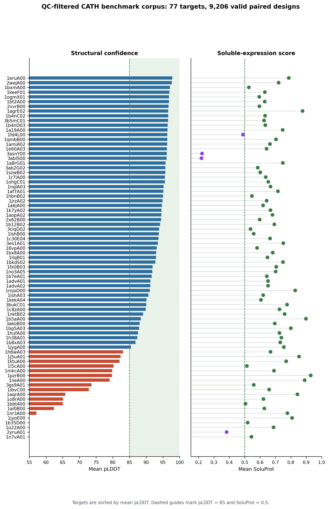
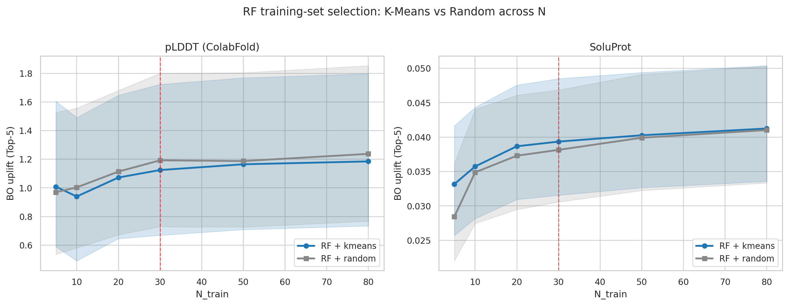
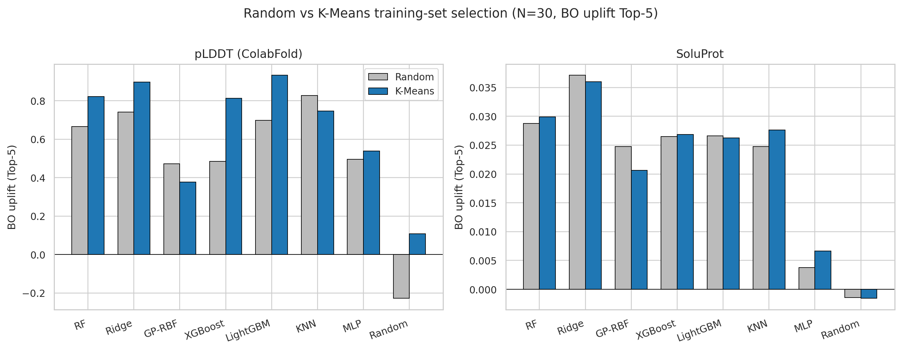
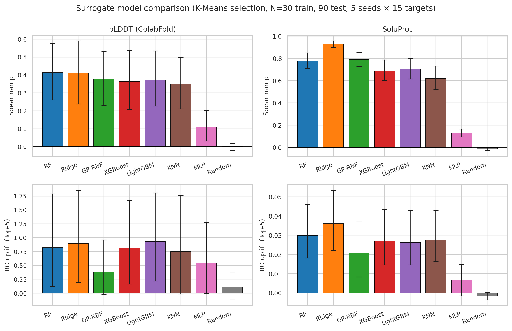
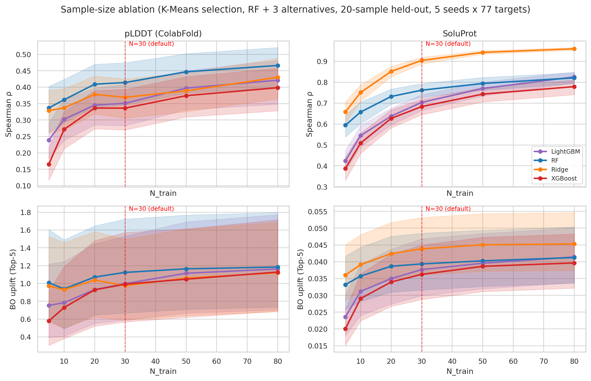
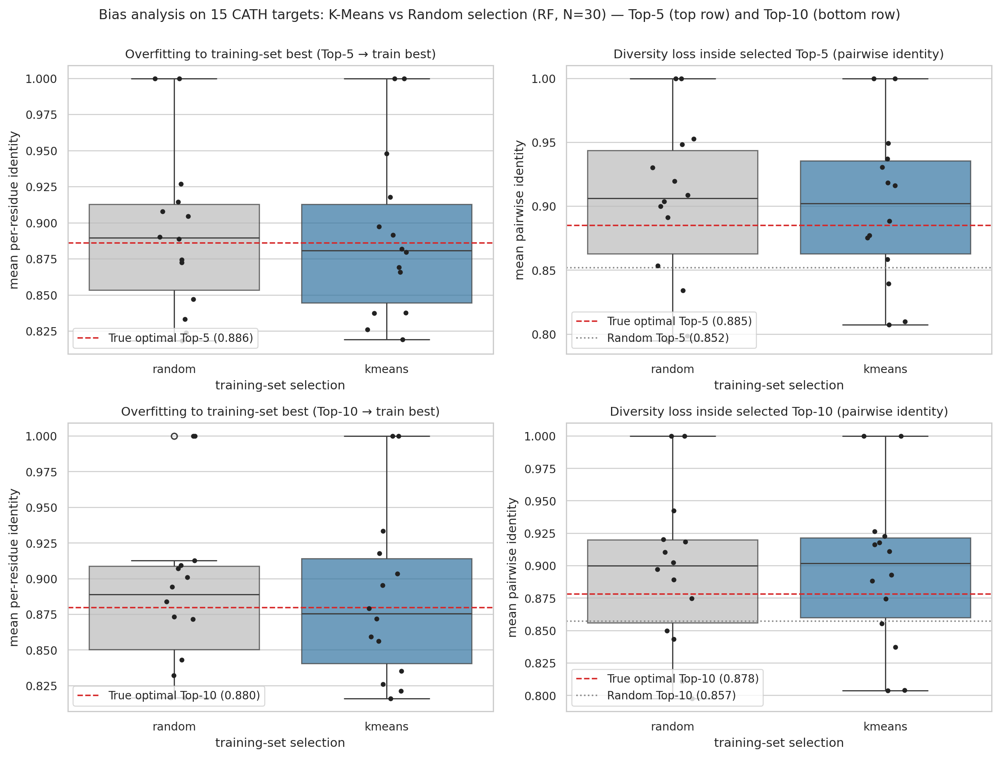
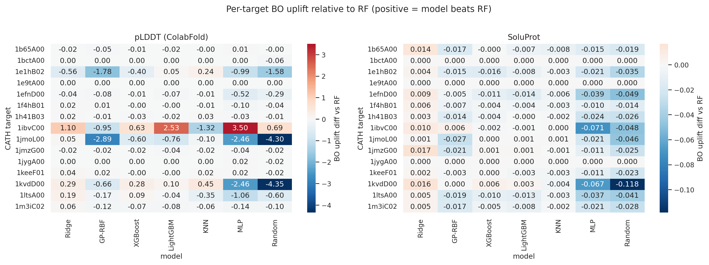
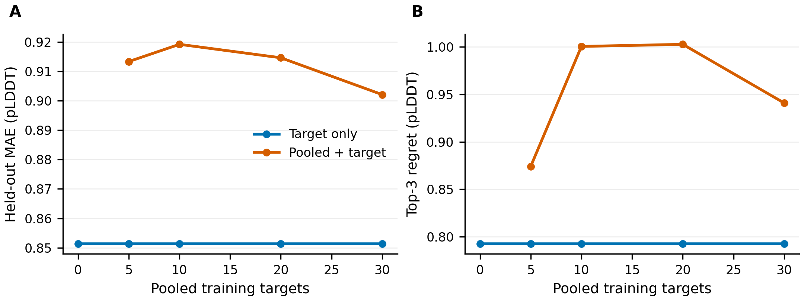

# Supplementary Material for RAPID

## Supplementary Note 1. Status of the CATH Benchmark Refresh

The main manuscript uses the corrected-chain CATH artifact refresh as the component-level evidence base for structure-prediction-budgeted surrogate-triage design choices. The refresh applies the corrected chain-selection contract introduced after the original pre-refresh archive and is mirrored under `public_data/benchmark/results/rapid_target_manifest.csv`. The released structural-context analysis summarizes 18 selected CATH targets under the original target backbone and selected RFdiffusion-derived (RFD3) backbone arms, with BioEmu-containing arms included only when they passed the fixed target-RMSD QC gate. The selected structural-context arms are the original target backbone, target plus BioEmu ensemble, selected RFD3 backbone, and RFD3 plus BioEmu ensemble.

## Supplementary Note 2. Current CATH Artifact Corpus

The corrected-chain CATH refresh archive contains 115 completed CATH run directories (24 train, 29 val, 62 test under the corrected-chain split). Seventy-seven runs passed the QC rule requiring all three conservation tiers, at least 100 valid non-fallback amino-acid design sequences, and at least 100 paired SoluProt/pLDDT records. The included subset contains 9,206 paired SoluProt/pLDDT design rows. The 38 excluded runs did not meet the paired-record or non-fallback-sequence thresholds and were dropped before analysis. Ten QC-passing targets had mean pLDDT below 70 and are retained for downstream analyses but flagged as low-confidence in the per-target summary; their identity collapse behavior matches the rest of the corpus.

*Supplementary Figure S1. Target-level summary of the corrected-chain CATH artifact corpus. The figure shows target-level pLDDT and SoluProt heterogeneity across 77 QC-passing targets after excluding fallback or AF2-infrastructure-failed runs.*

| Metric                                         | Value |
|------------------------------------------------|-------|
| Completed CATH runs parsed                     | 115   |
| QC-included targets                            | 77    |
| QC-excluded runs (incomplete or fallback-only) | 38    |
| Valid paired design rows                       | 9,206 |
| Positive pLDDT records                         | 9,206 |
| SoluProt records                               | 9,206 |
| Mean pLDDT                                     | 86.92 |
| Maximum pLDDT                                  | 98.25 |
| Mean SoluProt                                  | 0.663 |
| Maximum SoluProt                               | 0.976 |

## Supplementary Note 3. Training-Set Selection

In the corrected-chain CATH refresh, K-means and random bootstrap selection give comparable Random Forest BO uplift Top-5 across all N values tested. The K-means advantage observed at low N in the earlier, smaller artifact corpus does not persist in this larger corrected-chain refresh, where broader candidate-pool diversity reduces the selection-strategy gap. K-means remains the production default as a deterministic bootstrap-selection safeguard, although the present corpus does not show a consistent acquisition advantage over random bootstrap selection.

*Supplementary Figure S2. Random Forest BO uplift Top-5 as a function of the number of AF2-labeled training examples in the corrected-chain refresh. K-means and random selection track each other across the full N range.*

*Supplementary Figure S3. K-means versus random training-set selection at fixed N = 30 across surrogate families in the corrected-chain refresh. Within-family differences are small relative to between-family differences, supporting K-means as a stable bootstrap baseline rather than a universal acquisition advantage.*

| N   | Random RF pLDDT BO uplift Top-5 | K-means RF pLDDT BO uplift Top-5 | Delta        |
|-----|---------------------------------|----------------------------------|--------------|
| 5   | 0.970                           | 1.008                            | +0.038 (+4%) |
| 10  | 1.003                           | 0.940                            | -0.064 (-6%) |
| 20  | 1.114                           | 1.072                            | -0.041 (-4%) |
| 30  | 1.192                           | 1.124                            | -0.068 (-6%) |
| 50  | 1.187                           | 1.165                            | -0.022 (-2%) |
| 80  | 1.237                           | 1.185                            | -0.053 (-4%) |

## Supplementary Note 4. Surrogate Model Comparison

The surrogate-family benchmark was run on the fully labeled artifact pool used to choose the production operating point, rather than on the later strict 9,999-candidate triage runs. In this retrospective benchmark, each target-tier unit contained approximately 120 ProteinMPNN designs with SoluProt scores and AF2/ColabFold pLDDT records where available. Thirty candidates were selected by K-means as the bootstrap-labeled set, and the remaining labeled candidates were held out to evaluate whether each model could recover high-scoring designs from the same local candidate pool. This analysis is therefore a model-family benchmark for acquisition behavior; it is separate from the main-text surrogate-triage budget result, where only 30 bootstrap candidates and 20 acquired candidates are folded for each target. Supplementary Notes 4, 5, and 7 use different resampling protocols, training-budget axes, and pool compositions; absolute BO-uplift values should therefore be compared only within a note. (Notes 4 and 7 do share the same full-corpus RF pLDDT BO uplift of 1.055; the different value in Notes 3 and 5, 1.124, comes from the N-ablation resampling rather than a discrepancy.)

*Supplementary Figure S4. Retrospective surrogate-family comparison at K-means N = 30. The benchmark uses fully labeled target-tier candidate pools to compare model ranking and acquisition behavior for pLDDT and SoluProt objectives. It supports a configurable acquisition layer rather than a universal single-model rule.*

At K-means N = 30, Random Forest gives the highest mean pLDDT BO uplift Top-5 among the individual models shown here, whereas Ridge is strongest for SoluProt ranking and recall-oriented metrics. The production recommendation is therefore score-specific: Random Forest is a conservative pLDDT acquisition reference, and Ridge is retained when the operator prioritizes SoluProt-related ranking or recall. The implemented RAPID default treats these models as comparator policies: they are evaluated on the initial AF2-labeled bootstrap set, the selected acquisition policy is refit on all bootstrap labels, and only that policy’s Top-K is sent to AF2. With target-clustered bootstrap 95% confidence intervals, Ridge SoluProt Top-5 recall is 0.703 (0.664-0.743) versus random 0.051 (0.042-0.060), and RF pLDDT Top-5 recall is 0.131 (0.106-0.156) versus random 0.055 (0.046-0.064); RF-versus-random paired Wilcoxon tests with Holm correction give p = 2.0e-54 (Cliff's delta 0.84) for SoluProt and p = 4.1e-13 (Cliff's delta 0.26) for pLDDT. The main text summarizes the run-level budget and selected-candidate outcomes in Figure 2; the table below reports the numerical model-level comparison.

| Model    | pLDDT Spearman rho | pLDDT Top-5 recall | pLDDT BO uplift Top-5 | SoluProt Spearman rho | SoluProt Top-5 recall | SoluProt BO uplift Top-5 |
|----------|--------------------|--------------------|-----------------------|-----------------------|-----------------------|--------------------------|
| RF       | 0.429              | 0.131              | 1.055                 | 0.783                 | 0.489                 | 0.052                    |
| Ridge    | 0.382              | 0.123              | 0.962                 | 0.923                 | 0.703                 | 0.059                    |
| GP-RBF   | 0.457              | 0.089              | 0.659                 | 0.842                 | 0.423                 | 0.034                    |
| XGBoost  | 0.366              | 0.134              | 0.909                 | 0.703                 | 0.447                 | 0.049                    |
| LightGBM | 0.384              | 0.129              | 0.921                 | 0.725                 | 0.460                 | 0.049                    |
| KNN      | 0.401              | 0.104              | 0.890                 | 0.694                 | 0.434                 | 0.047                    |
| MLP      | 0.080              | 0.070              | 0.220                 | 0.133                 | 0.194                 | 0.011                    |
| Random   | -0.009             | 0.055              | -0.017                | 0.004                 | 0.051                 | 0.000                    |

## Supplementary Note 5. Sample-Size Operating Point

The N-ablation places N = 30 on a cost-efficient plateau. Increasing RF training labels from 30 to 80 requires approximately 2.7 times more AF2-labeled training examples but gives a modest additional pLDDT BO-uplift gain. The N = 30 default is therefore a conservative operating point for the bootstrap round. As noted in Supplementary Note 4, absolute BO-uplift values reported in this note use a different resampling protocol from Notes 4 and 7 and are not directly comparable across notes.

*Supplementary Figure S5. Sample-size ablation for production-supported surrogate families. The vertical reference at N = 30 marks the operating point used in RAPID. The curves show diminishing returns beyond roughly 20-30 AF2-labeled examples, supporting N = 30 as a conservative default rather than an arbitrary setting.*

| N_train | RF pLDDT BO uplift Top-5 | Percent of N = 80 | RF SoluProt BO uplift Top-5 | Percent of N = 80 |
|---------|--------------------------|-------------------|-----------------------------|-------------------|
| 5       | 1.008                    | 85.1%             | 0.0332                      | 80.4%             |
| 10      | 0.940                    | 79.3%             | 0.0357                      | 86.6%             |
| 20      | 1.072                    | 90.5%             | 0.0387                      | 93.7%             |
| 30      | 1.124                    | 94.9%             | 0.0394                      | 95.4%             |
| 50      | 1.165                    | 98.3%             | 0.0403                      | 97.6%             |
| 80      | 1.185                    | 100.0%            | 0.0413                      | 100.0%            |

## Supplementary Note 6. Acquisition Bias and Diversity

K-means training selection does not by itself remove acquisition bias. In the corrected-chain refresh, RF-selected Top-K sets remain more internally similar than the true Top-K sets, even when the bootstrap training set is selected by K-means. At N = 30, the K-means-trained RF Top-5 set had an internal identity of 0.888, compared with 0.863 for the true Top-5 set, and the corresponding Top-10 values were 0.885 and 0.865. This means diversity control belongs at acquisition time if sequence diversity is an explicit design objective.

Future diversity-aware acquisition policies, such as max-min filtering or cluster-balanced Top-K selection over ESM-2 embeddings, should be evaluated as acquisition-stage changes rather than as current performance claims [23].

*Supplementary Figure S6. Acquisition-bias analysis for RF at N = 30. K-means reduces identity to the best training sequence relative to random bootstrap selection, but surrogate-selected Top-K sets remain more internally similar than the true Top-K sets.*

*Supplementary Figure S7. Per-target BO uplift difference relative to Random Forest. The heatmap shows target-level winner switching that is obscured by aggregate means, supporting a configurable surrogate layer rather than a hard-coded single-model policy.*

| Metric                   | Random training | K-means training | True optimal | Random Top-K |
|--------------------------|-----------------|------------------|--------------|--------------|
| Top-5 overfit identity   | 0.874           | 0.860            | 0.850        | \-           |
| Top-5 internal identity  | 0.894           | 0.888            | 0.863        | 0.818        |
| Top-5 mean pLDDT         | 88.13           | 88.06            | 89.31        | 86.97        |
| Top-10 overfit identity  | 0.871           | 0.856            | 0.849        | \-           |
| Top-10 internal identity | 0.889           | 0.885            | 0.865        | 0.822        |
| Top-10 mean pLDDT        | 88.05           | 88.04            | 89.02        | 86.94        |

## Supplementary Note 7. Rank-Mean Ensemble

In the corrected-chain refresh with the expanded 77-target corpus, RF alone gives the highest mean pLDDT BO uplift (1.055), narrowly above the rank-mean and score-mean ensembles (1.030 and 1.019). As noted in Supplementary Note 4, BO-uplift values reported here use the full 77-target corpus and are not directly comparable with the per-target-tier values in Note 4 or the N-ablation in Note 5. The ensembles still produce slightly higher SoluProt BO uplift (rank-mean 0.062, score-mean 0.063 vs RF 0.059) and trim Top-10 internal identity by ~0.004, but none of the ensemble combinations removes acquisition diversity collapse. Rank-mean is therefore retained as an optional robustness layer rather than as a universal default. In RAPID, Auto-CV compares the configured individual models by default; the rank-mean ensemble is added only when the operator explicitly selects ensemble members or forces the ensemble policy. RAPID distinguishes comparator models from the acquisition policy: comparator predictions, CV metrics, model-selection summaries, feature-importance or coefficient tables, and fitted model files are exported for audit, but only one selected policy contributes the final Top-K AF2 acquisitions. The number of AF2/ColabFold calls therefore remains `N_train + Top-K` unless the operator explicitly increases the validation budget.

| Combination rule    | pLDDT BO uplift Top-5 | SoluProt BO uplift Top-5 | Top-10 internal identity |
|---------------------|-----------------------|--------------------------|--------------------------|
| RF                  | 1.055                 | 0.0588                   | 0.885                    |
| rank-mean ensemble  | 1.030                 | 0.0620                   | 0.881                    |
| score-mean ensemble | 1.019                 | 0.0632                   | 0.877                    |
| top-5 vote ensemble | 0.987                 | 0.0610                   | 0.875                    |
| Ridge               | 0.962                 | 0.0670                   | 0.862                    |
| LightGBM            | 0.921                 | 0.0556                   | 0.874                    |
| XGBoost             | 0.909                 | 0.0552                   | 0.871                    |

## Supplementary Note 8. Representative Surrogate-Budget Runs

Implementation-specific details that are too granular for the main Methods are collected here. This includes the paper-run launcher, exact request switches, exported CSV views, and run identifiers used to reconstruct the strict surrogate-budget benchmark.

The current strict paper run verifies the implemented surrogate-triage path under the manuscript operating point. The runner is `scripts/paper_runs/03_launch_surrogate_triage_budget.py`, which executes the standard pipeline with `evolution_mode=False`, `surrogate_triage_enabled=True`, `surrogate_triage_scope="pooled_tiers"`, RFD3/BioEmu/Relax disabled, and 3,333 generated ProteinMPNN candidates per 30/50/70% conservation tier. For each target, RAPID spends `N_train = 30` AF2/ColabFold calls on K-means bootstrap labels and `Top-K = 20` calls on surrogate-selected acquisitions. In the current implementation, `surrogate_triage_model="auto"` compares configured policies by internal CV on the bootstrap labels and records the selected policy under `surrogate_triage/model_selection.json`; per-tier AF2 score files point back to the same pooled selection artifact. The strict paper run used the GPU ESM embedding provider and disabled fallback sequence recovery, so the reported candidates were produced by ProteinMPNN rather than by deterministic recovery logic.

The release provides several CSV views of these runs. `public_data/benchmark/results/surrogate_triage_budget_summary.csv` is tier-level and therefore repeats the pooled pre-triage candidate count once for each conservation-tier output. `public_data/benchmark/results/surrogate_triage_budget_run_summary.csv` is target-level and counts the pooled candidate set once per run; this is the direct data source for the 49,946-candidate, 250-AF2-record aggregate reported in the main text. `surrogate_triage_cv_metrics.csv` records the internal policy comparison, `surrogate_triage_acquired_topk.csv` records the selected candidates and their observed AF2/SoluProt values, and `surrogate_triage_wt_metrics.csv` records one WT reference baseline per target. WT reference calls are not included in the 250 candidate-record budget.

| Target    | Run ID                                                          | Candidates entering triage | AF2 records | Reduction vs fold-all | Selected policy | Bootstrap labels | Top-K acquisitions |
|-----------|-----------------------------------------------------------------|----------------------------|-------------|-----------------------|-----------------|------------------|--------------------|
| 1a6jA00   | `paper_surrogate_pooled9999_strict_20260520_cath_train_1a6jA00` | 9,954                      | 50          | 99.5%                 | Ridge           | 30               | 20                 |
| 1a8rG01   | `paper_surrogate_pooled9999_strict_20260520_cath_train_1a8rG01` | 9,999                      | 50          | 99.5%                 | Ridge           | 30               | 20                 |
| 1a19A00   | `paper_surrogate_pooled9999_strict_20260520_cath_val_1a19A00`   | 9,999                      | 50          | 99.5%                 | RF              | 30               | 20                 |
| 1advA02   | `paper_surrogate_pooled9999_strict_20260520_cath_val_1advA02`   | 9,999                      | 50          | 99.5%                 | RF              | 30               | 20                 |
| 1h6wA03   | `paper_surrogate_pooled9999_strict_20260520_cath_val_1h6wA03`   | 9,995                      | 50          | 99.5%                 | Ridge           | 30               | 20                 |
| Aggregate | \-                                                              | 49,946                     | 250         | 99.5%                 | RF/Ridge        | 150              | 100                |

The WT reference values used in Figure 2D are shown below. These baselines were added after the strict candidate-selection run as reference artifacts only. They were not used to train the surrogate, select the Top-K candidates, or calculate the candidate-evaluation reduction.

| Target  | WT pLDDT | WT SoluProt | Selected Top-K contains candidate above WT on both proxies |
|---------|----------|-------------|------------------------------------------------------------|
| 1a6jA00 | 94.46    | 0.642       | yes                                                        |
| 1a8rG01 | 96.37    | 0.640       | yes                                                        |
| 1a19A00 | 97.67    | 0.629       | yes                                                        |
| 1advA02 | 90.37    | 0.529       | yes                                                        |
| 1h6wA03 | 81.54    | 0.593       | yes                                                        |

Earlier 3RGK and 1LVM traces are retained as implementation examples only; they used different candidate counts and Top-K settings and are not part of the current operating evidence. The Top-K default of 20 is an operating budget rather than a fitted hyperparameter. Together with the N = 30 bootstrap setting, it gives 50 AF2 calls per pooled target decision point when the SoluProt-scored pool exceeds the budget.

## Supplementary Note 9. Pooled Surrogate Scaling as a Guardrail Analysis

The completed CATH archive was also used to test whether accumulated surrogate labels already justify replacing RAPID’s per-target surrogate with a pooled model. This analysis is framed as a guardrail for the production default, not as a conclusion that accumulated labels lack value. RAPID currently uses lightweight per-run calibration because each target, backbone context, and conservation tier can change the sequence-quality relationship seen by the surrogate. If a pooled model were already stable under these conditions, it would support replacing per-run Auto-CV with a transferable surrogate. If not, the result supports the current decision to keep the production path adaptive and run-specific while continuing to store labels for future modeling.

Several factors could explain the absence of monotonic scaling, including sequence length, fold class, MSA depth, conservation pattern, and backbone context. The present analysis did not decompose these factors individually, but it shows why a future transferable model should be target-conditioned rather than simply larger.

This retrospective analysis parsed 10,890 AF2-labeled designs from the corrected-chain CATH refresh outputs. After excluding target-tier units with fewer than 35 positive pLDDT labels, 270 target-tier units from 92 targets remained evaluable. For each target-tier unit, 30 designs were used as the target calibration set and the remaining designs were held out. Candidate features were a 34-dimensional set of sequence-composition and ProteinMPNN-metadata features; this guardrail analysis does not use ESM-2 embeddings. (An ESM-2 feature variant was run separately on a smaller 38-target / 107-unit corpus and is not the source of the values reported in this note.) Labels were centered within each target-tier training set before fitting a ridge residual surrogate, so pooled data had to improve within-target ranking rather than merely learn target-level pLDDT offsets. However, centering the labels does not remove all heterogeneity: unnormalized feature distributions across different sequence lengths and target families can still introduce feature-space shifts, reinforcing that a future transferable model should be explicitly target-conditioned rather than simply larger.

The result did not support a monotonic pooled-model improvement. Target-only calibration gave a mean held-out top-3 regret of 0.793 pLDDT. Adding pooled-prior labels did not stabilize the regret: pool size 5 gave mean regret 0.874, pool size 10 gave 1.000, pool size 20 gave 1.003, and pool size 30 gave 0.941. Mean MAE also did not improve over the target-only baseline (target-only MAE 0.851; pooled-plus-target MAE 0.902–0.919 across pool sizes). The paired win rate for pooled-plus-target calibration was approximately 35% across pool sizes. RAPID therefore stores pooled surrogate labels and fitted-model artifacts for future cross-target modeling, but the present manuscript keeps the production default as target-specific calibration with per-run Auto-CV rather than claiming that a pooled surrogate has already improved generalization. In practical terms, the analysis supports a staged learning strategy: current RAPID runs perform local surrogate orchestration; subsequent campaigns should accumulate AF2 labels, assay labels, paired rankings, target metadata, and structural-context annotations as a preference dataset; only after sufficient labeled coverage should a target-conditioned preference model be evaluated as a transferable predictor.

*Supplementary Figure S8. Retrospective pooled-surrogate scaling from completed CATH artifacts. Lower values are better for both held-out MAE and top-3 regret. The composition-plus-ProteinMPNN-metadata ridge residual model (no ESM-2 features) did not show a monotonic benefit from adding more pooled targets, supporting the decision to keep per-run adaptive calibration as the production default while treating accumulated labels as a future preference-modeling substrate.*

| Training source                   | Pooled targets | Evaluable units | Mean MAE | Mean Top-3 regret | Median Spearman |
|-----------------------------------|----------------|-----------------|----------|-------------------|-----------------|
| Target calibration only           | 0              | 270             | 0.851    | 0.793             | 0.176           |
| Pooled prior + target calibration | 5              | 270             | 0.913    | 0.874             | 0.103           |
| Pooled prior + target calibration | 10             | 270             | 0.919    | 1.000             | -0.042          |
| Pooled prior + target calibration | 20             | 270             | 0.915    | 1.003             | 0.030           |
| Pooled prior + target calibration | 30             | 270             | 0.902    | 0.941             | 0.030           |

*Pooled surrogate scaling summary. The non-monotonic regret and unchanged or worse MAE indicate that the current completed CATH artifact set is useful for testing pooled-model infrastructure and label accumulation, but not yet sufficient to support a pooled-surrogate performance claim.*

## Supplementary Note 10. Experimental-Feedback Evolution Schema

The experimental-feedback evolution mode is included to define the data boundary between computational shortlisting and future assay-guided redesign. It is not used as evidence of experimental enrichment in the present manuscript. RAPID writes an `experiment_request.csv` after candidate generation and triage, and assay outcomes can later be recorded with stable candidate identifiers, metric names, values, units, metric direction, replicate identifiers, assay conditions, and optional quality flags.

| Field group         | Required fields                                                  | Purpose                                                                 |
|---------------------|------------------------------------------------------------------|-------------------------------------------------------------------------|
| Candidate identity  | `candidate_id`, `sequence_id`                                    | Links a measured result to the generated sequence and run artifact.     |
| Assay metric        | `metric_name`, `metric_value`, `metric_unit`, `metric_direction` | Defines the objective that the next-round surrogate should learn.       |
| Measurement context | `replicate_id`, `condition`, optional `quality_flag`             | Preserves replicate, condition, and failure/dropout handling for audit. |

When labels for the requested objective are present, RAPID trains a local surrogate on the labeled records and writes `next_candidates.csv` for the next design-test-learn cycle. This output is a recommendation table, not a biological validation result.

## Supplementary Note 11. Structural-Context Ablation

The corrected-chain structural-context ablation compares the original target backbone, BioEmu conformational sampling, one selected RFD3 backbone, and RFD3+BioEmu across 18 selected CATH targets. Because ProteinMPNN is conditioned on the supplied backbone, these arms test whether changing structural context perturbs the accessible sequence neighborhood under matched masking and AF2 budgets. The single-backbone and RFD3 arms are evaluable for all 18 targets. BioEmu is evaluable for nine targets and RFD3+BioEmu for eight targets — those that passed the fixed 2.0 Å target-RMSD gate. The main text summarizes this claim in Figure 3 as a distribution-spread and diversity analysis rather than as an aggregate-mean or upper-tail model ranking.

The 18 ablation targets were drawn from the corrected-chain CATH refresh manifest (`selected_for_structural_context = true`) to provide a fold-class and sequence-length range representative of typical solubility-aware redesign campaigns, and were selected without any prior screening for BioEmu sampling success. The observed ~50% RMSD-gate attrition is therefore an empirically representative rate for unconditional BioEmu application, not the result of an adversarial selection or worst-case stress test. Reporting this attrition rate is intentional: it supports the broader claim that BioEmu evaluability is a per-target property that must be verified in the artifact record rather than assumed from sequence-level features, and it justifies treating RFD3 and BioEmu as controlled exploration modules with explicit QC rather than as default score-improvement components. The pattern analysis in Supplementary Note 12 confirms that the non-evaluable and evaluable target groups are statistically indistinguishable on simple sequence metadata (length, multi-chain rate, ligand presence, train/val/test partition), so the residual attrition is not explained by a single covariate that would have allowed reliable pre-filtering.

The paired view supports this interpretation. RFD3 increased pLDDT range relative to the single-backbone arm in 14 of 18 targets (Wilcoxon p = 0.002), increased SoluProt range in 9 of 18 targets, and increased sequence diversity in 9 of 18 targets (Wilcoxon p = 0.010). BioEmu increased pLDDT range and mean pairwise sequence diversity in all nine evaluable paired targets (Wilcoxon p = 0.004 for both) and increased SoluProt range in 8 of 9 targets (Wilcoxon p = 0.008). RFD3+BioEmu increased pLDDT range and sequence diversity in all eight evaluable paired targets (Wilcoxon p = 0.008 for both), and increased SoluProt range in 6 of 8 targets. Across this 12-test family (four pool-shape metrics x three context arms), Holm correction leaves three shifts significant -- RFD3 pLDDT range (raw 0.002, Holm 0.023) and BioEmu pLDDT range and diversity (raw 0.004, Holm 0.043 each) -- whereas the others are nominal trends only: RFD3 diversity, RFD3+BioEmu pLDDT range and diversity, and BioEmu SoluProt range (all Holm 0.070), and BioEmu mean pLDDT (raw 0.039, Holm 0.195). These data support structural-context allocation as a way to alter candidate-pool spread and diversity, not as evidence that any structural-context module is universally superior.

The table below retains the numerical summary and BioEmu QC context. Because the arms are evaluable on different target subsets (single and RFD3 on all 18, BioEmu on 9, RFD3+BioEmu on 8), these arm means are not directly comparable: restricting the single-backbone arm to the nine BioEmu-evaluable targets lowers its mean pLDDT range from 2.99 to 1.85 (median 1.30 vs 1.31), and the RFD3 mean (4.66) is inflated by two outliers (1hufA00 range 28.1, 1h6wA03 10.0; median 3.31). The paired within-target tests above and the medians are the reliable comparison.

| Arm                      | Evaluable targets | Mean pLDDT range | Mean SoluProt range | Mean pairwise diversity |
|--------------------------|-------------------|------------------|---------------------|-------------------------|
| Single target backbone   | 18                | 2.99             | 0.146               | 0.147                   |
| Target + BioEmu ensemble | 9                 | 3.82             | 0.226               | 0.294                   |
| RFD3 selected backbone   | 18                | 4.66             | 0.163               | 0.167                   |
| RFD3 + BioEmu ensemble   | 8                 | 3.80             | 0.256               | 0.310                   |

## Supplementary Note 12. BioEmu Target-RMSD Gate QC

BioEmu-containing structural-context arms were required to satisfy the same 2.0 Å target-RMSD gate used in the primary four-arm refresh. This gate is part of the artifact contract: a BioEmu arm is quantitatively evaluable only when the requested near-target conformers are recovered. Across the expanded 18-target ablation, eight targets did not recover any conformer under the 2.0 Å cutoff within the 10-attempt BioEmu budget, and one additional target (1iieA00) was non-evaluable due to a separate BioEmu backend execution failure rather than the RMSD gate. RFD3+BioEmu was additionally non-evaluable for 1a6jA00, where the RFD3-conditioned BioEmu samples drifted further from the target backbone. These cases are therefore treated as not evaluable for BioEmu-based score comparison, rather than as zero-valued design outcomes. A sensitivity rerun increases the BioEmu sampling and maximum-attempt budgets to 30 while preserving the 2.0 Å acceptance gate.

| Target  | BioEmu accepted/attempted | BioEmu min RMSD (Å) | RFD3+BioEmu accepted/attempted | RFD3+BioEmu min RMSD (Å) | Primary handling                         |
|---------|---------------------------|---------------------|--------------------------------|--------------------------|------------------------------------------|
| 1a6jA00 | 3/6                       | 1.615               | 0/10                           | 12.241                   | RFD3+BioEmu not evaluable                |
| 1agrE02 | 0/10                      | 4.229               | 0/10                           | 4.229                    | Not evaluable                            |
| 1b12B02 | 0/10                      | 2.993               | 0/10                           | 2.993                    | Not evaluable                            |
| 1h6wA03 | 0/10                      | 22.664              | 0/10                           | 22.664                   | Not evaluable                            |
| 1hufA00 | 0/10                      | 3.478               | 0/10                           | 3.478                    | Not evaluable                            |
| 1iieA00 | backend execution failure | n/a                 | backend execution failure      | n/a                      | Not evaluable (BioEmu execution failure) |
| 1j5uA01 | 0/10                      | 5.393               | 0/10                           | 5.393                    | Not evaluable                            |
| 2auaB01 | 0/10                      | 8.051               | 0/10                           | 8.051                    | Not evaluable                            |
| 3jvoG00 | 0/10                      | 2.887               | 0/10                           | 3.219                    | Not evaluable                            |
| 3twkA01 | 0/10                      | 4.976               | 0/10                           | 4.976                    | Not evaluable                            |

*BioEmu target-RMSD gate outcomes for the non-evaluable arms in the expanded 18-target structural-context refresh. The 1a6jA00 row reports BioEmu alone as evaluable and only the RFD3-conditioned variant as failed; 1iieA00 was excluded from BioEmu-based scoring because of a separate backend execution failure rather than a structural quality decision. The table reports the initial 10-attempt BioEmu runs only. The sensitivity rerun changes the sampling budget but keeps the acceptance gate fixed, avoiding post-hoc relaxation of the structural-quality criterion.*

**Pattern of RMSD-gate attrition.** The nine BioEmu-alone non-evaluable targets span a range of failure severities rather than clustering at a single mode. Three are borderline (min RMSD 2.0–3.5 Å: 3jvoG00 at 2.887 Å, 1b12B02 at 2.993 Å, 1hufA00 at 3.478 Å) and are the most likely to be recovered by the expanded 30-attempt sensitivity rerun; three are moderate (3.5–6 Å: 1agrE02 at 4.229 Å, 3twkA01 at 4.976 Å, 1j5uA01 at 5.393 Å); and two are severe (\>6 Å: 2auaB01 at 8.051 Å, 1h6wA03 at 22.664 Å), with 1h6wA03 in particular indicating that BioEmu’s pretrained sampling distribution does not cover this target’s near-native basin within the configured budget. The nine non-evaluable and nine evaluable targets are statistically indistinguishable on simple sequence-level metadata: mean length 166 vs 157 residues (ranges 93–291 vs 89–287), multi-chain quaternary structure rates 75% vs 78%, and non-MSE ligand presence 50% vs 56% respectively, with train/val/test partition also balanced (2/5/2 vs 2/5/2). A distinct failure mode appears in 1a6jA00, where BioEmu alone passes (3 of 6 accepted, min 1.615 Å) but the RFD3-conditioned variant drifts to 12.241 Å min RMSD — a pattern consistent with RFD3 generating a backbone outside the local basin BioEmu’s pretrained sampling can recover. Together, these observations argue that RMSD-gate attrition reflects the union of borderline sampling variance, target-specific conformational diversity beyond BioEmu’s training distribution, and occasional RFD3-induced backbone drift, rather than a single sequence-level covariate. Practical guidance for users is therefore to treat BioEmu evaluability as a per-target property to verify in the artifact record, not as a property predictable from sequence length, ligand presence, or chain count alone.

## Supplementary References

[23] Kulesza, A., & Taskar, B. (2012). Determinantal Point Processes for Machine Learning. *Foundations and Trends in Machine Learning*, 5(2-3), 123-286. doi:10.1561/2200000044
