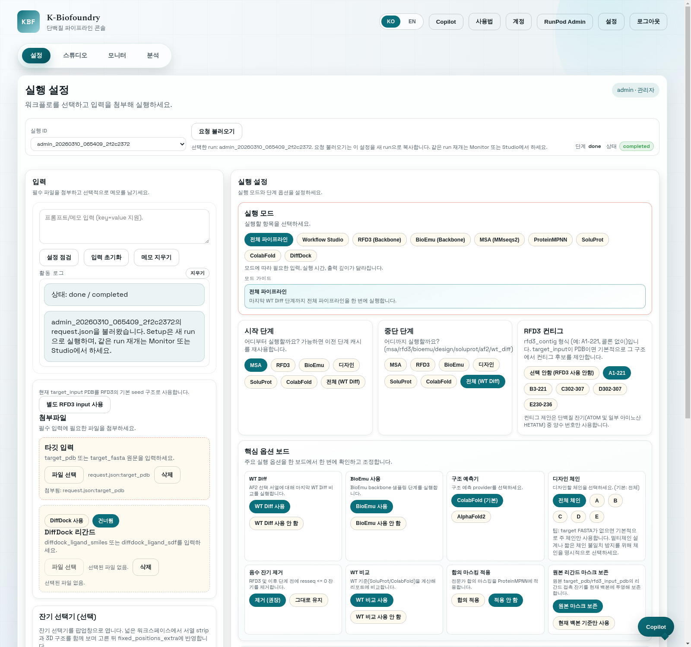
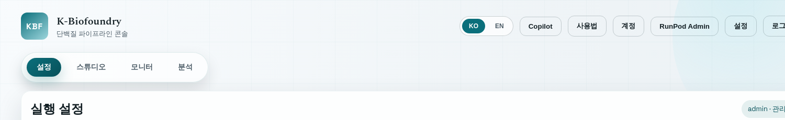
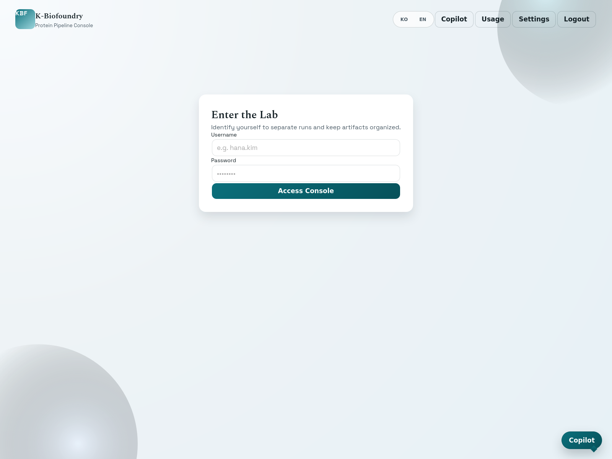
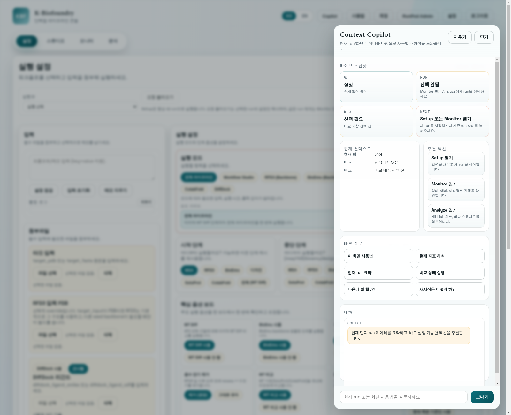
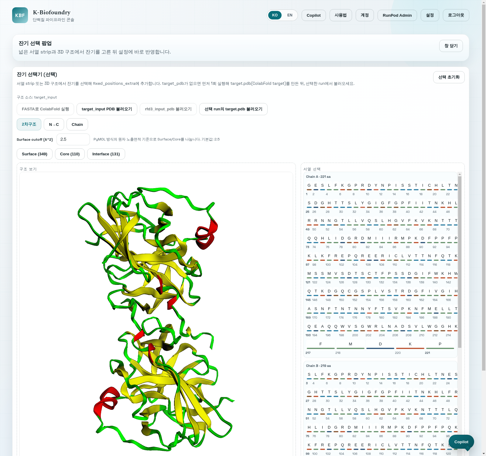
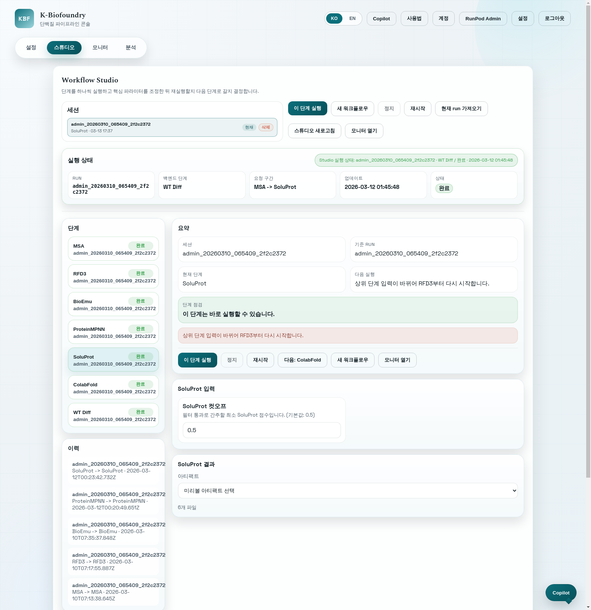
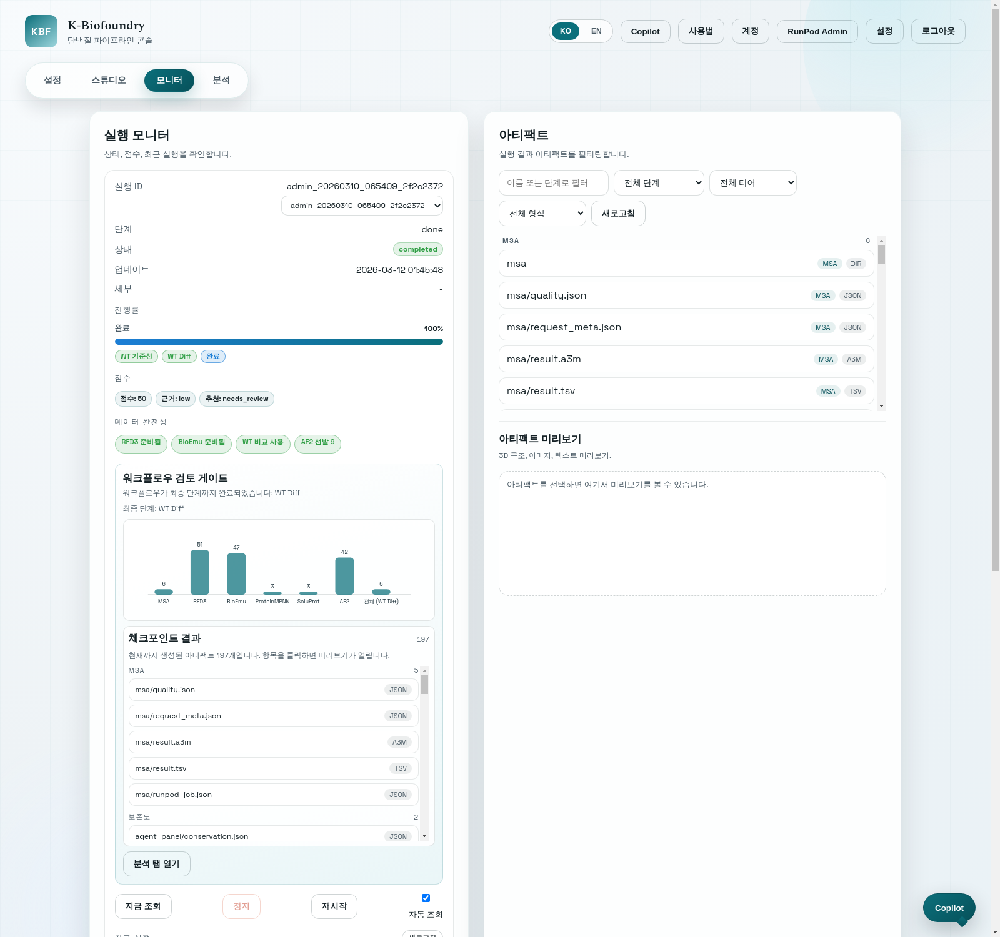
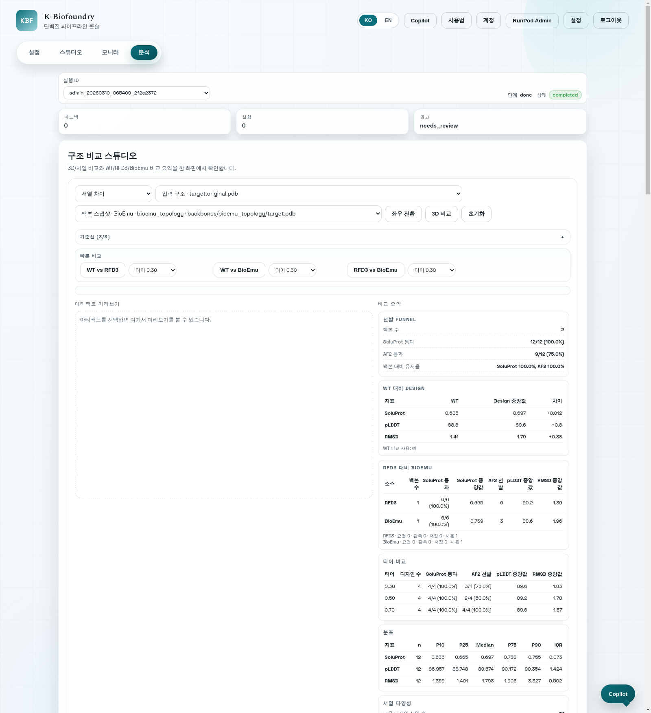
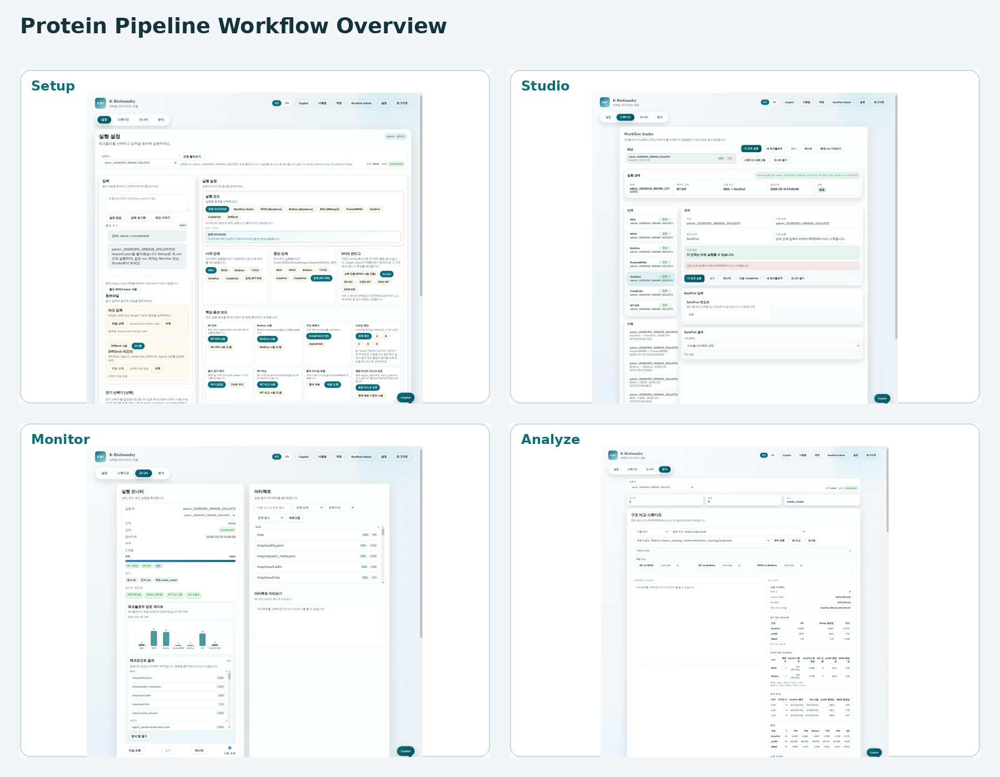

# Protein Pipeline Console 사용자 매뉴얼

작성 기준: 2026-03-13 현재 저장소의 UI(`frontend/index.html`, `frontend/app.js`)  
문서 대상: 연구자, 분석자, 운영자, 관리자  
문서 목적: 처음 사용하는 사용자도 로그인부터 실행, 단계별 재실행, 비교, 리포트 저장까지 혼자 수행할 수 있도록 매우 자세하게 설명합니다.

이 문서는 2026-03-13 기준 실제 UI 화면 캡처를 포함합니다. 이후 UI가 바뀌면 같은 위치의 그림만 교체해도 PDF용 매뉴얼을 계속 갱신할 수 있습니다.
예시 화면은 주로 `admin_20260310_065409_2f2c2372` run과 관리자 계정 화면을 기준으로 캡처했습니다.

## 목차
1. 문서 사용 방법
2. 시스템을 이해하는 핵심 개념
3. 시작 전 준비
4. 빠른 시작
5. 로그인과 상단 공통 UI
6. Setup 탭 사용법
7. Residue Picker 팝업 사용법
8. Studio 탭 사용법
9. Monitor 탭 사용법
10. Analyze 탭 사용법
11. 자주 사용하는 작업 시나리오
12. 문제 해결과 FAQ
13. 용어 정리
14. 자주 보는 출력 파일

---

## 1. 문서 사용 방법

이 매뉴얼은 단순 기능 설명서가 아니라 실제 작업 순서 중심으로 구성되어 있습니다.

- 처음 사용하는 경우:
  `4. 빠른 시작`부터 읽고 바로 한 번 실행해 보세요.
- 이미 실행은 해 봤지만 Studio/Analyze가 헷갈리는 경우:
  `8. Studio 탭 사용법`, `10. Analyze 탭 사용법`을 먼저 보세요.
- Residue Picker, WT Diff, Compare Studio 같은 세부 기능이 헷갈리는 경우:
  `7. Residue Picker 팝업 사용법`, `12. 문제 해결과 FAQ`, `13. 용어 정리`를 함께 보세요.
- PDF 제작 시:
  `docs/assets/user-manual/` 아래의 그림 파일을 그대로 사용하면 됩니다. 화면이 바뀌면 같은 파일명만 교체해도 본문 구조를 유지할 수 있습니다.


*그림 1. 메인 화면 전체 예시. 상단 탭, 공통 버튼, Setup 화면의 기본 구성이 함께 보입니다.*

---

## 2. 시스템을 이해하는 핵심 개념

Protein Pipeline Console은 단백질 설계 파이프라인을 웹 UI에서 다룰 수 있게 만든 콘솔입니다. 사용자는 입력을 준비하고 실행한 뒤, 결과를 비교하고, 최종 후보를 선별하고, 의견과 실험 결과까지 기록할 수 있습니다.

이 시스템을 이해할 때 가장 중요한 개념은 아래 4개입니다.

### 2.1 `run_id`는 실제 실행 단위입니다

- `run_id`는 서버에서 실제로 실행된 파이프라인 작업을 뜻합니다.
- 결과 파일은 보통 `outputs/<run_id>/...` 아래에 저장됩니다.
- `run_id`가 다르면 완전히 다른 실행입니다.
- Monitor와 Analyze는 주로 `run_id`를 기준으로 움직입니다.

### 2.2 Studio의 `session_id`는 브라우저 편집 세션입니다

- Studio 세션은 사용자가 브라우저에서 단계별로 입력을 만지고 재실행 전략을 잡는 로컬 작업 세션입니다.
- `Studio 세션 삭제`는 브라우저에 저장된 세션 기록만 지웁니다.
- 이미 서버에 존재하는 `run_id` 결과 파일은 자동으로 지워지지 않습니다.

### 2.3 Setup은 새 실행 준비, Studio는 단계별 제어입니다

- `Setup`은 새 실행을 준비하는 탭입니다.
- 기존 실행을 불러와도 `Load Request`는 설정을 복사할 뿐이며, 기본적으로는 새 실행을 시작합니다.
- 같은 `run_id`를 이어서 제어하거나 특정 단계만 다시 돌릴 때는 `Studio` 또는 `Monitor`의 `Resume Run` 흐름을 사용합니다.

### 2.4 Analyze는 실행 이후 해석과 선별을 위한 탭입니다

- `Compare Studio`에서 구조/서열 차이를 봅니다.
- `Hit List`에서 후보를 점수로 정렬합니다.
- `Feedback`, `Experiment`, `Report`에서 평가와 기록을 남깁니다.

### 2.5 주요 탭 역할 요약

| 탭 | 역할 | 언제 사용하나 |
| --- | --- | --- |
| `Setup` | 새 실행 준비 | 입력을 처음 넣고 새 run을 시작할 때 |
| `Studio` | 단계별 rerun/fork 제어 | 특정 단계만 다시 실행하거나 워크플로우를 단계별로 진행할 때 |
| `Monitor` | 상태/로그/아티팩트 확인 | 실행 중인 상태를 보거나, 완료된 run의 산출물을 점검할 때 |
| `Analyze` | 비교/선별/리포트 | 완료된 run에서 후보를 비교하고 최종 후보를 정할 때 |

### 2.6 주요 실행 모드 요약

| 실행 모드 | 의미 | 적합한 상황 |
| --- | --- | --- |
| `pipeline` | 전체 파이프라인 실행 | 일반적인 end-to-end 설계 |
| `workflow` | 체크포인트 기반 워크플로우 실행 | 단계별로 중간 검토를 하면서 진행하고 싶을 때 |
| `rfd3` | RFD3 관련 단계 중심 실행 | 백본 생성/검토가 주목적일 때 |
| `bioemu` | BioEmu 관련 단계 중심 실행 | BioEmu 샘플링이 주목적일 때 |
| `msa` | MSA까지만 실행 | 서열 검색/보존도 준비만 확인하고 싶을 때 |
| `design` | ProteinMPNN 디자인 단계 중심 | 고정 위치와 설계 조건을 바꿔 디자인만 다시 만들고 싶을 때 |
| `soluprot` | SoluProt 필터까지 포함 | 용해도 기준으로 설계 후보를 다시 거르고 싶을 때 |
| `af2` | 구조 예측 중심 | 선택된 서열의 구조 예측만 다시 보고 싶을 때 |
| `diffdock` | 도킹만 실행 | 리간드 도킹만 별도로 확인하고 싶을 때 |


*그림 2. 상단 탭 바 확대 화면. `Setup`, `Studio`, `Monitor`, `Analyze`의 위치와 상단 공통 버튼을 한눈에 확인할 수 있습니다.*

---

## 3. 시작 전 준비

### 3.1 브라우저 준비

- 팝업 차단을 풀어 두는 것이 좋습니다.
- Residue Picker는 현재 팝업창으로 열립니다.
- 팝업이 막히면 잔기 선택기를 열 수 없습니다.

### 3.2 준비하면 좋은 입력 자료

- `target_input`
  설명: FASTA 또는 PDB 텍스트
- `rfd3_input_pdb`
  설명: 선택적 override용 PDB. `target_input`이 PDB이면 기본적으로 그 구조를 RFD3 seed로 사용하므로, 다른 seed backbone을 쓰고 싶을 때만 필요
- `rfd3_contig`
  설명: 예를 들어 `A1-221`
- ligand 정보
  설명: DiffDock 또는 ligand masking이 필요한 경우
- 설계 체인 정보
  설명: 어떤 chain을 디자인 대상으로 쓸지

### 3.3 처음부터 알아 두면 좋은 규칙

- `Setup`에서 `Load Request`를 눌러도 기존 run을 그대로 이어서 돌리는 것은 아닙니다.
- `New Workflow`는 빈 Studio 세션을 만듭니다.
- `Adopt Current Run`은 현재 선택된 run을 Studio에 가져옵니다.
- `Conserved 30/50/70` preset은 항상 보이는 기능이 아닙니다.
  설명: 선택한 run에 MMseqs2/conservation 결과가 있어야 표시됩니다.
- `Surface`, `Core`, `Interface` preset은 다시 누르면 해제됩니다.
- Residue Picker에서 아무 것도 선택하지 않은 상태로 `반영 후 닫기`를 누르면 `fixed_positions_extra`가 비워집니다.

---

## 4. 빠른 시작

처음 사용하는 사용자를 위한 가장 짧은 추천 순서는 아래와 같습니다.

1. 로그인합니다.
2. `Setup` 탭에서 `Run Mode`를 `pipeline`으로 둡니다.
3. `Target Input`에 FASTA 또는 PDB를 넣습니다.
4. 필요하면 `Design Chains`, `WT Compare`, `BioEmu`, `RFD3` 관련 옵션을 설정합니다.
5. 잔기 고정이 필요하면 `Residue Picker (선택)`를 사용합니다.
6. `Check Setup`으로 사전 점검을 합니다.
7. `Run`을 눌러 새 run을 시작합니다.
8. `Monitor` 탭에서 상태와 아티팩트를 확인합니다.
9. 완료 후 `Analyze` 탭에서 `Compare Studio`, `Hit List`, `Report`를 봅니다.
10. 필요하면 `Feedback`과 `Experiment`를 기록합니다.

### 4.1 가장 안전한 첫 실행 패턴

- 입력이 단순한 경우:
  FASTA만 넣고 `pipeline` 모드로 시작합니다.
- 구조 기반 설계인 경우:
  PDB를 넣고 `Design Chains`, `fixed_positions_extra`, `WT Compare`를 함께 조정합니다.
- 중간 확인이 매우 중요한 경우:
  `workflow` 모드를 사용하고 Monitor의 `Workflow Review Gate`를 기준으로 다음 단계를 진행합니다.


*그림 3. 초보자용 빠른 시작 예시. `Setup` 탭에서 입력 영역과 실행 설정 영역을 함께 확인할 수 있습니다.*

---

## 5. 로그인과 상단 공통 UI

### 5.1 로그인

환경에 따라 두 방식 중 하나를 사용할 수 있습니다.

- 일반 로그인:
  사용자명과 비밀번호를 입력합니다.
- SSO 로그인:
  `KBF SSO` 버튼이 있는 경우 해당 경로를 사용합니다.


*그림 4. 로그인 화면 예시. 사용자명과 비밀번호를 입력해 콘솔에 접근합니다.*

로그인 후 상단에 현재 사용자 정보가 표시되며, 사용자별로 run prefix가 관리됩니다.

### 5.2 상단 버튼

상단 바에는 아래 기능이 있습니다.

- `KO / EN`
  설명: UI 언어 전환
- `Copilot`
  설명: 현재 run과 화면 문맥을 바탕으로 사용법, 해석, 다음 행동을 묻는 도우미
- `Usage`
  설명: 짧은 인앱 사용 가이드
- `Account`
  설명: 계정 관련 이동 버튼. 환경 설정에 따라 보일 수 있음
- `Settings`
  설명: 리포트 언어 설정, Health Check
- `Logout`
  설명: 로그아웃
- `Admin`
  설명: 관리자만 사용자 생성 가능

### 5.3 Settings

`Settings`에서 주로 확인하는 항목은 아래와 같습니다.

- `MCP HTTP 기본 URL`
  설명: 서버 주소 확인용
- `Report Language`
  설명: `Auto`, `English`, `Korean`
- `Health Check`
  설명: 백엔드가 응답하는지 간단히 점검

### 5.4 Copilot

Copilot은 대화형 보조 패널입니다. 현재 화면과 현재 run을 바탕으로 빠른 안내를 제공합니다.

주요 구성은 아래와 같습니다.

- `Live Snapshot`
  설명: 현재 실행 상태, 비교 상태, 추천 등 핵심 요약
- `Current Context`
  설명: 현재 탭과 현재 run 기반 컨텍스트
- `Suggested Actions`
  설명: Analyze 열기, Poll, Refresh Artifacts, Generate Report 같은 바로가기 액션
- `Quick Prompts`
  설명: 자주 쓰는 질문 버튼
- `Conversation`
  설명: 자유 입력 질문

질문 예시:

- `이 화면 사용법`
- `현재 지표 해석`
- `비교 상태 설명`
- `다음에 뭘 할까?`
- `재시작은 어떻게 해?`


*그림 5. 상단 공통 UI와 Copilot 패널 예시. 현재 문맥, 빠른 질문, 추천 액션을 함께 볼 수 있습니다.*

---

## 6. Setup 탭 사용법

`Setup`은 새 실행을 준비하는 화면입니다. 이 탭은 크게 `입력 영역`, `실행 설정 영역`, `활동 로그`로 나뉩니다.

### 6.1 화면 구조

- 왼쪽 입력 영역:
  `Target Input`, 첨부 파일, 메모, 활동 로그
- 오른쪽 실행 설정 영역:
  `Run Mode`, 옵션, `Run` 버튼
- 상단 run context:
  선택한 기존 run의 상태 확인, `Load Request`

### 6.2 기존 run 선택과 `Load Request`

Setup 상단에는 기존 run 선택 박스가 있습니다.

- 여기서 run을 선택하면 해당 run의 상태를 참고할 수 있습니다.
- `Load Request`를 누르면 그 run의 `request.json` 설정을 현재 Setup 폼으로 복사합니다.
- 이 동작은 `설정 복사`이지 `같은 run 재개`가 아닙니다.
- 같은 run을 이어서 처리하고 싶다면 `Monitor`의 `Resume Run` 또는 `Studio`를 사용하세요.

이 부분은 매우 중요합니다.

- `Setup = 새 run 준비`
- `Studio / Monitor = 기존 run 제어`

### 6.3 입력 메모 영역

상단 메모 영역은 자유 텍스트를 적는 곳입니다.

- 실험 목적
- 설계 가정
- 현재 주의 사항
- 팀 메모

버튼은 아래와 같습니다.

- `Check Setup`
  설명: 사전 점검
- `Reset Inputs`
  설명: Setup 입력 초기화
- `Clear Note`
  설명: 메모만 지우기

### 6.4 입력 파일과 주요 입력값

가장 자주 쓰는 입력은 아래와 같습니다.

| 항목 | 설명 | 비고 |
| --- | --- | --- |
| `Target Input` | FASTA 또는 PDB 텍스트 | 시스템이 자동 판별 |
| `RFD3 Input PDB` | RFD3용 별도 구조 override | `target_input`이 PDB일 때는 보통 필요 없음 |
| `RFD3 Contig` | RFD3 contig 문자열 | 예: `A1-221` |
| `Design Chains` | 디자인할 체인 | 기본은 전체 |
| `Fixed Positions (Extra)` | 강제로 고정할 위치 | Residue Picker와 연동 |
| `WT Compare` | WT 기준 비교 실행 여부 | Analyze와 Report에 영향 |
| `Enable BioEmu` | BioEmu 샘플링 사용 여부 | 백본 다양성 확인용 |

### 6.5 Run Mode 선택

`Run Mode`는 실행 깊이를 바꿉니다.

실무적으로는 아래처럼 이해하면 가장 쉽습니다.

- `pipeline`
  설명: 일반적인 전체 실행
- `workflow`
  설명: 단계별 체크포인트 검토가 필요한 실행
- `rfd3`, `bioemu`, `msa`, `design`, `soluprot`, `af2`, `diffdock`
  설명: 특정 단계만 집중 실행

### 6.5.1 `target_input`과 `RFD3 Input PDB`의 관계

이 부분은 자주 헷갈리는 항목입니다.

- `target_input`이 `PDB`이면:
  Setup은 그 구조를 기본적으로 RFD3 seed로 사용합니다.
- `RFD3 Input PDB`는:
  기본 입력을 대체하는 `선택적 override`입니다.
- 즉 일반적인 구조 기반 설계에서는:
  `target_input PDB + RFD3 Contig`만으로 충분한 경우가 많습니다.
- 별도 `RFD3 Input PDB`가 필요한 경우는:
  비교 기준 구조와 RFD3 seed 구조를 다르게 쓰고 싶을 때,
  또는 `target_input`이 FASTA라서 RFD3용 PDB를 따로 지정해야 할 때입니다.

현재 UI에서는 이 원칙에 맞춰:

- `target_input`이 PDB이면 `RFD3 Input PDB`를 기본적으로 숨깁니다.
- 필요하면 `별도 RFD3 input 사용` 버튼으로 펼칠 수 있습니다.
- 다시 기본값으로 돌아가고 싶으면 `target_input 기본값 사용`을 누르면 됩니다.

### 6.6 자주 쓰는 옵션 설명

| 옵션 | 의미 | 실무 팁 |
| --- | --- | --- |
| `Start From` | 어느 단계부터 시작할지 | 기존 산출물 재사용에 영향 |
| `Stop After` | 어디서 멈출지 | 테스트 실행에 유용 |
| `WT Compare` | WT 기준선 계산 | Analyze 해석에 매우 유용 |
| `Apply Mask Consensus` | 마스크 합의 적용 | 고정 위치 제약 강화 시 사용 |
| `BioEmu Samples` | 생성 샘플 수 | 많을수록 탐색 폭 증가 |
| `{AF2/ColabFold} pLDDT Cutoff` | 구조 예측 통과 기준 | 기본 컷오프 점검 필요 |
| `{AF2/ColabFold} RMSD Cutoff` | 기준 구조와의 거리 컷오프 | 너무 빡빡하면 후보가 사라질 수 있음 |
| `SoluProt Cutoff` | 용해도 필터 기준 | 후반 선별 품질에 영향 |

### 6.7 `Check Setup`이 하는 일

`Check Setup`은 실행 전에 아래를 점검합니다.

- 필수 입력이 있는지
- 실행 모드와 입력 조합이 맞는지
- 현재 설정으로 막히는 항목이 있는지
- 경고와 블로킹 이슈가 무엇인지

사전 점검 결과는 보통 아래처럼 읽으면 됩니다.

- `Required inputs`
  설명: 입력이 더 필요함
- `Blocking issues`
  설명: 그대로는 실행 불가
- `Warnings`
  설명: 실행은 되지만 주의 필요

### 6.8 `Run` 버튼

`Run` 버튼은 필수 입력이 충족되어야 활성화됩니다.

`Run`을 누르면:

1. 현재 설정으로 새 `run_id`가 준비됩니다.
2. 백엔드에 실행 요청이 전달됩니다.
3. 실행 상태가 Setup 하단 상태 줄과 Monitor에서 보이기 시작합니다.

### 6.9 Setup에서 꼭 기억할 점

- Setup은 새 run을 시작하는 곳입니다.
- 기존 run을 이어서 쓰는 곳이 아닙니다.
- 이전 run 설정을 참고하고 싶을 때만 `Load Request`를 사용하세요.


*그림 6. Setup 탭 전체 예시. 좌측 입력 영역과 우측 실행 설정 영역을 함께 보여 줍니다.*

---

## 7. Residue Picker 팝업 사용법

Residue Picker는 `fixed_positions_extra`를 편하게 지정하기 위한 도구입니다.

### 7.1 언제 보이나

Residue Picker는 보통 `pipeline` 또는 `workflow` 실행에서 고정 위치 입력이 필요한 경우 나타납니다.

### 7.2 어떻게 여나

Setup 또는 Studio에서 `잔기 선택기 (선택)` 카드의 `팝업창으로 열기`를 누릅니다.

팝업이 열리지 않으면:

- 브라우저 팝업 차단을 해제해야 합니다.
- 필요하면 메인 탭을 강력 새로고침한 뒤 다시 시도합니다.

### 7.3 팝업 안에서 할 수 있는 일

Residue Picker 팝업에서는 아래 작업을 할 수 있습니다.

- 구조 소스 불러오기
- 서열 strip에서 잔기 선택
- 3D 구조에서 잔기 선택
- preset 선택
- 선택 결과를 `fixed_positions_extra`에 반영
- 현재 선택을 전부 초기화

### 7.4 구조 소스

주로 아래 구조 소스를 사용할 수 있습니다.

- `target_input PDB`
- `rfd3_input_pdb` override
- `선택한 run의 target.pdb`
- `FASTA로 AF2/ColabFold 실행`해서 만든 target 구조

중요한 점:

- 구조가 로드되어야 3D 선택과 sequence strip이 의미 있게 동작합니다.
- PDB가 없는 상태에서는 잔기 번호 매핑이 불가능할 수 있습니다.
- `target_input`이 PDB이면 보통 그 구조만으로도 Residue Picker와 RFD3 contig 제안이 가능합니다.
- `rfd3_input_pdb`는 다른 seed backbone을 강제로 쓰고 싶은 경우에만 override로 사용하면 됩니다.

### 7.5 sequence strip 선택

sequence strip은 잔기를 줄 단위로 보여 주는 뷰입니다.

- 각 잔기를 클릭하면 선택 또는 해제됩니다.
- 잔기 번호가 함께 보입니다.
- 색은 아미노산 성질 그룹을 반영합니다.

대표적인 색 분류:

- hydrophobic
- polar
- positive
- negative
- aromatic
- special

### 7.6 3D 구조 선택

3D 뷰에서도 잔기를 직접 클릭할 수 있습니다.

- sequence strip과 3D 선택은 항상 연동됩니다.
- 한쪽에서 선택하면 다른 쪽도 즉시 반영됩니다.
- 현재 선택한 잔기는 요약 문자열로 표시됩니다.

### 7.7 preset 버튼

Residue Picker에는 아래 preset이 있습니다.

- `Surface`
- `Core`
- `Interface`
- `Conserved 30`
- `Conserved 50`
- `Conserved 70`

`Surface`와 `Core`는 단순 neighbor 수가 아니라 원자 노출면적 기준으로 계산됩니다.

- 기본 `Surface cutoff`는 `2.5`입니다.
- 이 값은 PyMOL의 surface residue 판정과 유사한 방식으로, 노출된 원자 면적 threshold로 사용됩니다.
- cutoff를 낮추면 더 많은 잔기가 `Surface`로 잡히고, 높이면 더 엄격해집니다.
- `Core`는 현재 cutoff에서 `Surface`로 분류되지 않은 잔기입니다.
- `Interface`는 별도로 chain 간 근접도 기준으로 계산되며 `Surface/Core`와 겹칠 수 있습니다.

동작 규칙은 아래와 같습니다.

- `Surface`, `Core`, `Interface`
  설명: 현재 로드한 구조를 기준으로 계산합니다.
- 같은 preset을 다시 누르면 해제됩니다.
- `Conserved 30/50/70`
  설명: 선택한 run에 MMseqs2/conservation 결과가 있을 때만 표시되거나 활성화됩니다.
- brand-new run처럼 아직 보존도 결과가 없는 상태에서는 conserved preset이 보이지 않거나 비활성 상태일 수 있습니다.

### 7.8 반영과 초기화

버튼 의미는 아래와 같습니다.

- `반영 후 닫기`
  설명: 현재 선택을 `fixed_positions_extra`에 반영하고 팝업을 닫습니다.
- `선택 초기화`
  설명: 현재 선택 상태와 반영된 `fixed_positions_extra`를 비웁니다.

중요:

- 아무 잔기도 선택하지 않은 상태에서 `반영 후 닫기`를 누르면 `fixed_positions_extra`를 비우는 동작으로 처리됩니다.
- 팝업 바깥 카드의 `선택 초기화`도 같은 의미입니다.

### 7.9 `fixed_positions_extra`와의 관계

팝업에서 고른 잔기는 내부적으로 chain별 query position 기준으로 저장되어 `fixed_positions_extra`에 들어갑니다.

입력 형식 예시:

```json
{"A":[6,10],"*":[120]}
```

또는 shorthand 예시:

```text
A:6,10;*:120
```

### 7.10 Residue Picker 사용 시 권장 순서

1. 구조 소스를 먼저 정합니다.
2. chain과 번호가 정상적으로 보이는지 확인합니다.
3. sequence strip이나 3D에서 직접 선택합니다.
4. 필요하면 `Surface/Core/Interface`를 추가로 눌러 범위를 넓힙니다.
5. 결과를 확인한 뒤 `반영 후 닫기`를 누릅니다.


*그림 7. Residue Picker 팝업 예시. 좌측 3D 구조, 우측 sequence strip, 상단 preset 버튼과 cutoff 입력을 함께 보여 줍니다.*

---

## 8. Studio 탭 사용법

Studio는 단계별 재실행과 rerun/fork 판단을 위한 작업 공간입니다.

### 8.1 Studio를 쓰는 이유

아래와 같은 상황에서 Studio가 가장 유용합니다.

- `Design` 단계만 다시 돌리고 싶을 때
- `AF2`만 다시 선별하고 싶을 때
- 어떤 입력이 upstream에 영향을 주는지 보면서 rerun 범위를 판단하고 싶을 때
- workflow 실행의 다음 체크포인트로 넘어가기 전에 결과를 보고 싶을 때

### 8.2 상단 툴바 버튼

Studio 상단에는 아래 버튼이 있습니다.

- `Run This Stage`
  설명: 현재 선택한 단계 실행
- `New Workflow`
  설명: 빈 Studio 세션 생성
- `Stop Run`
  설명: 현재 실행 중인 Studio run 중지 요청
- `Resume Run`
  설명: 중단된 run 재개
- `Adopt Current Run`
  설명: Monitor/Analyze에서 보고 있는 현재 run을 Studio로 가져오기
- `Refresh Studio`
  설명: 상태와 세션 새로고침
- `Open Monitor`
  설명: 현재 run을 Monitor에서 열기

### 8.3 `New Workflow`와 `Adopt Current Run`의 차이

이 둘은 혼동하기 쉽습니다.

| 버튼 | 의미 |
| --- | --- |
| `New Workflow` | 빈 새 Studio 세션 생성 |
| `Adopt Current Run` | 현재 선택된 실제 run을 Studio에 연결 |

즉:

- 새로 시작하고 싶으면 `New Workflow`
- 이미 실행된 결과를 기반으로 단계별 제어를 하고 싶으면 `Adopt Current Run`

### 8.4 Session 리스트

왼쪽 세션 리스트는 브라우저에 저장된 Studio 작업 목록입니다.

- 세션은 로컬 편집 문맥입니다.
- 세션 삭제는 로컬 세션 삭제입니다.
- 서버의 출력 파일 삭제와는 다릅니다.

### 8.5 Execution Status 패널

상단 상태 패널에는 아래가 표시됩니다.

- `Run`
- `Backend Stage`
- `Requested`
- `Updated`
- `State`

이 패널은 현재 Studio 세션이 실제로 어떤 run에 연결되어 있는지 빠르게 보여 줍니다.

### 8.6 Summary / Stages / Editor / Results / Actions

Studio 메인 영역은 보통 아래 성격의 정보로 구성됩니다.

- `Summary`
  설명: 현재 세션, head run, 현재 단계, 다음 실행 방향
- `Stages`
  설명: 각 단계 상태
- `Editor`
  설명: 현재 단계에서 수정 가능한 입력
- `Results`
  설명: 현재 단계의 대표 산출물과 기타 파일
- `Actions`
  설명: 실행, 재실행, 모니터 이동 등

### 8.7 Studio의 rerun 판단 문구 읽는 방법

Studio는 현재 변경 내용을 보고 아래 같은 안내를 보여 줄 수 있습니다.

- `현재 run을 재사용해 이 단계만 실행합니다.`
- `이 단계부터 새 run을 시작합니다.`
- `상위 단계 입력이 바뀌었습니다. Studio가 MSA부터 새 run으로 fork합니다.`
- `상위 단계 입력이 바뀌어 {stage}부터 다시 시작합니다.`

실무적으로 해석하면:

- downstream만 바뀌면 현재 run 일부 재사용 가능
- upstream 입력이 바뀌면 더 앞 단계부터 다시 시작해야 함

### 8.8 Stage Check

Studio에는 단계별 실행 가능 여부를 점검하는 `Stage Check`가 있습니다.

대표적인 메시지:

- `This stage is ready to run`
- `Resolve the issues below before running this stage`
- `Design outputs are not available`
- `SoluProt-passed sequences are not available`
- `AF2-selected sequences are not available`

즉, 현재 단계보다 앞단의 필수 산출물이 없으면 Studio가 이를 알려 줍니다.

### 8.9 Studio에서 Residue Picker 사용

Studio의 design 관련 입력에서도 Residue Picker를 열 수 있습니다.

이 경우에도 동작은 Setup과 동일합니다.

- 팝업으로 열림
- 선택 후 `fixed_positions_extra`에 반영
- `선택 초기화` 가능
- 적용 후 다시 열었을 때 이전 반영 상태를 복원

### 8.10 Studio 세션 삭제와 run 삭제의 차이

반드시 구분해야 합니다.

- `Delete Session`
  설명: 브라우저의 Studio 세션만 삭제
- `Delete Run`
  설명: 실제 run 결과 삭제. 되돌릴 수 없음


*그림 8. Studio 탭 전체 예시. 세션 리스트, 단계 버튼, 입력 패널, 실행 상태 요약을 함께 확인할 수 있습니다.*

---

## 9. Monitor 탭 사용법

Monitor는 현재 run 상태와 산출물을 확인하는 중심 탭입니다.

### 9.1 Run Monitor 카드

주요 표시 항목:

- `Run ID`
- `Stage`
- `State`
- `Updated`
- `Detail`
- `Progress`
- `Scoring`
- `Data Completeness`

`Stage`와 `State`는 가장 먼저 봐야 합니다.

예:

- `running`
- `completed`
- `failed`
- `cancelled`

### 9.2 Progress

Progress 영역에서는 단계별 진행 흐름을 봅니다.

예를 들어 아래 개념이 반영됩니다.

- `MSA`
- `Backbone`
- `WT Baseline`
- `Masking`
- `Design`
- `SoluProt`
- `AF2`
- `Done`

### 9.3 Scoring

Scoring 영역에는 보통 아래 정보가 표시됩니다.

- `Score`
- `Evidence`
- `Recommendation`

이 값은 최종 후보 선별을 위한 요약 신호입니다. 자세한 해석은 Analyze의 Hit List와 Report에서 함께 보는 것이 좋습니다.

### 9.4 Data Completeness

Data Completeness 배지는 현재 run에서 어떤 데이터가 준비되어 있는지 빠르게 보여 줍니다.

예:

- `RFD3 ready`
- `BioEmu ready`
- `WT compare on`
- `AF2 selected N`

### 9.5 Workflow Review Gate

`workflow` 실행에서는 Monitor에 `Workflow Review Gate`가 나타날 수 있습니다.

이 영역에서 할 수 있는 일:

- 다음 체크포인트까지 계속 진행
- 특정 stage까지 rerun
- 현재까지 나온 체크포인트 산출물 확인
- 필요 시 Analyze로 이동

즉, workflow 모드에서는 Monitor가 단순 관찰 화면이 아니라 `진행 제어` 화면이 되기도 합니다.

### 9.6 상단 액션 버튼

- `Poll Now`
  설명: 상태 즉시 조회
- `Stop Run`
  설명: 실행 중지 요청
- `Resume Run`
  설명: 중단된 run 재개
- `Auto Poll`
  설명: 자동 상태 새로고침

### 9.7 Recent Runs

최근 run 목록에서는 아래 작업이 가능합니다.

- run 선택
- 상태 확인
- 필요 시 삭제

관리자라면 `Show all runs` 옵션이 보일 수 있습니다.

### 9.8 Artifacts

Artifacts 패널에서는 run 산출물을 단계, tier, 파일 형식으로 필터링할 수 있습니다.

주요 기능:

- 이름/단계 필터
- stage filter
- tier filter
- type filter
- `Refresh`
- 파일 클릭 후 미리보기

### 9.9 Artifact Preview

미리보기는 파일 종류에 따라 동작이 다릅니다.

- PDB류:
  3D 구조 뷰
- 텍스트 파일:
  본문 표시
- 이미지:
  바로 보기
- 바이너리:
  미리보기 제한 가능

### 9.10 Agent Panel

Agent Panel은 단계별 해석과 복구 노트를 보여 줍니다.

주요 버튼:

- `Refresh`
- `View Report`
- `View Agent Report`

완료된 run을 해석할 때는 Agent Panel과 Analyze를 함께 보는 것이 좋습니다.


*그림 9. Monitor 탭 전체 예시. Run 상태 요약과 Artifact 패널을 같은 화면에서 확인할 수 있습니다.*

---

## 10. Analyze 탭 사용법

Analyze는 완료된 run을 해석하고, 비교하고, 최종 후보를 정리하는 탭입니다.

### 10.1 상단 run context

Analyze 상단에는 현재 분석 대상 run을 선택하는 영역이 있습니다.

여기서 확인하는 값:

- `Run ID`
- `Stage`
- `State`

### 10.2 상단 KPI

Analyze 상단 KPI는 아래 3가지를 빠르게 보여 줍니다.

- `Feedback`
- `Experiments`
- `Recommendation`

### 10.3 Compare Studio

Compare Studio는 Analyze의 핵심 기능입니다.

#### 10.3.1 기본 개념

- 기본 뷰는 `Sequence Diff`입니다.
- 필요하면 `Structure Diff`로 바꿀 수 있습니다.
- 좌측은 보통 기준 구조, 우측은 후보 구조입니다.

#### 10.3.2 주요 컨트롤

- `Sequence Diff / Structure Diff`
- 좌측 구조 선택
- 우측 구조 선택
- `Swap`
- `Compare 3D`
- `Clear`

#### 10.3.3 Compare Studio에서 보이는 띠 3개

- `Resolved Baselines`
  설명: 입력 구조, Working Backbone, WT ColabFold 같은 기준선
- `Quick Compare`
  설명: 자주 쓰는 비교 조합 바로가기
- `Manifest / Context strip`
  설명: 구조 출처와 정리된 컨텍스트

#### 10.3.4 Quick Compare 예시

- `Input vs WT`
- `Input vs Working`
- `Input vs RFD3`
- `Input vs BioEmu`
- `WT vs RFD3`
- `WT vs BioEmu`
- `RFD3 vs BioEmu`

#### 10.3.5 Compare Context 읽는 법

각 라벨에 마우스를 올리면 간단한 설명이 나타납니다.

대표 필드:

- `Role`
- `Source`
- `Provenance`
- `Tier`
- `Backbone`
- `Chains`
- `Fixed Count`
- `WT Seq Diff`
- `Input RMSD`
- `WT CF RMSD`
- `Working RMSD`
- `Common CA`
- `{AF2/ColabFold} Scope`
- `{AF2/ColabFold} Selected`
- `{AF2/ColabFold} pLDDT`
- `{AF2/ColabFold} RMSD`
- `Path`

해석 팁:

- `Role`
  설명: 이 구조가 입력 구조인지, working backbone인지, WT인지, 후보인지 구분
- `WT CF RMSD`
  설명: WT 서열을 ColabFold로 예측한 기준 구조와의 RMSD
- `{AF2/ColabFold} Scope`
  설명: 정확 후보인지, WT 기준인지, tier 요약인지 같은 범위 설명

#### 10.3.6 Sequence Diff와 Structure Diff의 차이

- `Sequence Diff`
  설명: 서열 기준 차이
- `Structure Diff`
  설명: 구조 정렬 후 좌표 차이

즉, 구조 차이는 mutation과 같은 의미가 아닙니다. 같은 잔기라도 좌표가 달라지면 구조 차이로 표시될 수 있습니다.

#### 10.3.7 3D 뷰어 설명

3D 뷰어에는 현재 색 기준을 알려 주는 legend와 residue hover 정보가 제공됩니다.

- legend
  설명: 구조 색 기준
- hover
  설명: chain, residue number, residue name, 선택 여부 등

### 10.4 Artifact File Viewer

Analyze 안에서도 아티팩트 파일을 직접 열 수 있습니다.

주요 사용 예:

- `designs.fasta` 확인
- `summary.json` 확인
- `comparisons.json` 확인
- PDB 구조 미리보기

### 10.5 Feedback

Feedback은 전문가 리뷰를 남기는 기능입니다.

입력 항목:

- `Rating`
- `Reasons`
- `Artifact`
- `Stage`
- `Comment`

저장 후:

- 목록으로 다시 확인 가능
- CSV / TSV 내보내기 가능

### 10.6 Experiment

Experiment는 wet-lab 결과를 기록하는 영역입니다.

입력 항목:

- `Assay Type`
- `Result`
- `Sample ID`
- `Artifact`
- `Metrics (JSON)`
- `Conditions / Notes`

예를 들어 `kd_nM`, `t50_C` 같은 값을 JSON으로 넣을 수 있습니다.

### 10.7 Report

Report 패널에서는 run 요약 리포트를 다룹니다.

주요 버튼:

- `Load`
- `Generate`
- `Rendered View`
- `Export Package`
- `Save`

설명:

- `Load`
  기존 리포트 불러오기
- `Generate`
  비교 요약과 리포트 산출물 생성
- `Rendered View`
  렌더링된 문서 형태로 보기
- `Export Package`
  결과 패키지 내보내기
- `Save`
  수정한 리포트 저장

### 10.8 Report Review

리포트를 평가하는 영역입니다.

입력 항목:

- `Rating`
- `Reasons`
- `Comment`

### 10.9 Run-to-Run Compare

현재 run과 다른 baseline run을 비교하는 기능입니다.

비교할 수 있는 대표 항목:

- pLDDT
- RMSD
- SoluProt
- pass-rate delta

### 10.10 Hit List

Hit List는 최종 후보 랭킹입니다.

조절 가능한 항목:

- `Score Cutoff`
- `Rows`
- `SoluProt W`
- `pLDDT W`
- `RMSD W`

현재 UI 기준에서 `WT Diff`는 참고 지표로 보여 주되, 기본 가중치 중심은 SoluProt, pLDDT, RMSD입니다.

#### 10.10.1 WT 차이 컬럼 읽는 법

`WT Diff (n/len · identity)`는 아래 의미입니다.

- `n/len`
  설명: WT와 다른 위치 수 / 비교 길이
- `identity`
  설명: WT와의 서열 상동성 비율

즉, `%`는 차이율이 아니라 `identity`로 읽어야 합니다.

#### 10.10.2 차트

Analyze에서는 Hit List 기반 차트도 볼 수 있습니다.

예:

- `Scatter: pLDDT vs RMSD`
- `Histogram: Hit Score`
- `Tier AF2 Pass Rate`


*그림 10. Analyze 탭 전체 예시. Compare Studio, 비교 요약, 후보 표를 함께 볼 수 있습니다.*

---

## 11. 자주 사용하는 작업 시나리오

### 11.1 새 pipeline run 시작

1. `Setup`으로 이동합니다.
2. `Run Mode`를 `pipeline`으로 둡니다.
3. `Target Input`에 FASTA 또는 PDB를 넣습니다.
4. 필요하면 `Design Chains`, `WT Compare`, `BioEmu`를 조정합니다.
5. 잔기 고정이 필요하면 Residue Picker를 사용합니다.
6. `Check Setup`을 눌러 문제를 확인합니다.
7. `Run`을 누릅니다.
8. `Monitor`에서 진행 상황을 확인합니다.

### 11.2 이전 설정을 참고해 새 run 시작

1. Setup 상단 run selector에서 이전 run을 선택합니다.
2. `Load Request`를 누릅니다.
3. 필요한 값만 수정합니다.
4. `Run`을 누릅니다.

주의:

- 이 흐름은 `같은 run 재개`가 아닙니다.
- 이전 설정을 복사한 새 run입니다.

### 11.3 단계별로 다시 돌리고 싶을 때

1. `Studio`로 이동합니다.
2. 필요하면 `Adopt Current Run`을 누릅니다.
3. 원하는 stage를 선택합니다.
4. stage editor에서 값을 수정합니다.
5. Studio의 rerun 안내 문구를 읽습니다.
6. `Run This Stage`를 누릅니다.

### 11.4 완전히 빈 Studio 세션이 필요할 때

1. `Studio`에서 `New Workflow`를 누릅니다.
2. 빈 세션에서 새 설계를 시작합니다.

### 11.5 고정 잔기만 다시 지정하고 싶을 때

1. Setup 또는 Studio에서 `팝업창으로 열기`를 누릅니다.
2. 구조 소스를 불러옵니다.
3. 서열 strip 또는 3D에서 잔기를 고릅니다.
4. 필요하면 preset을 사용합니다.
5. `반영 후 닫기`를 누릅니다.

### 11.6 후보 3개를 추천하기 위한 기본 분석 순서

1. `Analyze`에서 run을 선택합니다.
2. `Compare Studio`에서 WT, RFD3, BioEmu 차이를 봅니다.
3. `Run-to-Run Compare`가 필요하면 baseline run을 선택합니다.
4. `Hit List`에서 cutoff와 rows를 조정합니다.
5. 상위 후보의 identity, pLDDT, RMSD, SoluProt을 함께 봅니다.
6. `Report`를 생성합니다.
7. `Feedback` 또는 `Experiment`를 기록합니다.

---

## 12. 문제 해결과 FAQ

### 12.1 Residue Picker 팝업이 안 열립니다

가능한 원인:

- 브라우저 팝업 차단
- 오래 열린 탭에 이전 JS가 남아 있음

해결:

1. 메인 탭을 강력 새로고침합니다.
2. 기존 팝업을 닫습니다.
3. 팝업 차단을 해제합니다.
4. 다시 `팝업창으로 열기`를 누릅니다.

### 12.2 Residue Picker에서 구조를 못 불러옵니다

가능한 원인:

- `target_input`이 PDB가 아님
- 선택한 run에 `target.pdb`가 아직 없음
- FASTA만 있고 구조 생성이 아직 안 됨

해결:

- PDB를 직접 넣거나
- 선택한 run을 바꿔서 `target.pdb`를 불러오거나
- FASTA 기반으로 AF2/ColabFold target 구조 생성을 실행합니다.

### 12.2.1 `RFD3 Input PDB`가 안 보입니다

대부분 정상입니다.

- `target_input`이 이미 PDB이고
- 현재 실행 경로에서 그 구조를 그대로 RFD3 seed로 쓸 수 있으면
- UI는 `RFD3 Input PDB`를 기본적으로 숨깁니다.

이 경우에는 별도 RFD3 입력이 없어도 됩니다.

다른 seed backbone을 강제로 쓰고 싶다면:

1. Setup에서 `별도 RFD3 input 사용`을 누르거나
2. Studio의 RFD3 단계에서 같은 버튼을 눌러
3. 별도 PDB를 첨부하면 됩니다.

### 12.3 `Conserved 30 / 50 / 70`이 안 보입니다

이건 정상일 수 있습니다.

이 preset은 선택한 run에 이미 MMseqs2/conservation 결과가 있어야 의미가 있습니다. 따라서 brand-new Setup 초기 상태에서는 보이지 않거나 사용할 수 없는 것이 맞습니다.

### 12.4 `Surface / Core / Interface`가 해제되지 않습니다

현재 정상 동작은 `다시 클릭하면 해제`입니다. 만약 해제가 안 되면 브라우저에 이전 JS가 남은 경우가 많으므로 강력 새로고침 후 다시 확인하세요.

### 12.5 Studio 세션을 삭제했는데 run 결과가 남아 있습니다

정상입니다.

- `Delete Session`
  설명: 브라우저의 Studio 세션만 삭제
- 실제 서버 run 결과 삭제와는 별개

### 12.6 새 Workflow를 눌렀는데 아무 것도 안 채워져 있습니다

정상입니다.

현재 `New Workflow`는 빈 세션 생성입니다. 기존 run을 가져오고 싶으면 `Adopt Current Run`을 사용하세요.

### 12.7 Setup에서 이전 run을 불러왔는데 왜 새 run이 생기나요

정상입니다.

`Load Request`는 설정 복사입니다. Setup은 새 run 준비 화면입니다.

### 12.8 Compare Studio에서 Comparison Summary가 비어 있습니다

가능한 원인:

- 리포트 관련 산출물이 아직 없음

해결:

- `Generate Report`를 먼저 실행합니다.

### 12.9 Hit List가 비어 있습니다

가능한 원인:

- 아직 run 완료 전
- cutoff가 너무 높음
- AF2 selected 후보가 없음

해결:

- run 완료 여부 확인
- cutoff 낮추기
- SoluProt / AF2 필터 기준 점검

### 12.10 `WT Diff`가 아직 시작 전인데 완료처럼 보입니다

새 Studio 세션과 현재 전역 run 상태가 섞이면 사용자가 혼동할 수 있습니다. 현재 기준으로는 새 빈 Workflow는 이전 run 완료 상태를 자동 상속하지 않도록 맞춰져 있습니다. 만약 이상해 보이면 새로고침 후 세션을 다시 확인하세요.

### 12.11 리포트 언어가 원하는 대로 안 보입니다

`Settings`에서 `Report Language`를 확인하세요.

- `Auto`
- `English`
- `Korean`

### 12.12 UI가 예전 상태처럼 보입니다

프런트엔드가 업데이트된 직후에는 브라우저 캐시 때문에 예전 JS/CSS가 남아 있을 수 있습니다.

해결:

1. 메인 탭 강력 새로고침
2. 열어 둔 팝업 닫기
3. 다시 열기

---

## 13. 용어 정리

| 용어 | 뜻 |
| --- | --- |
| `WT` | Wild Type |
| `WT Compare` | WT 기준선 계산 및 비교 |
| `WT Diff` | 최종 WT 비교 단계 |
| `RFD3` | backbone 생성 관련 단계 |
| `BioEmu` | backbone 샘플링 관련 단계 |
| `MMseqs2` | 서열 검색과 MSA 생성 |
| `ProteinMPNN` | 서열 디자인 생성 |
| `SoluProt` | 용해도 필터 |
| `AF2` | AlphaFold2 계열 구조 예측 |
| `ColabFold` | 구조 예측 provider 중 하나 |
| `pLDDT` | 구조 예측 신뢰도 지표 |
| `RMSD` | 기준 구조와의 거리 차이 지표 |
| `fixed_positions_extra` | 강제로 고정할 위치 |
| `Design Chains` | 설계 대상으로 잡은 chain |
| `Tier 30/50/70` | 보존도/설계 레인의 구분 |
| `run_id` | 실제 서버 실행 단위 |
| `session_id` | Studio 로컬 세션 단위 |

---

## 14. 자주 보는 출력 파일

결과 파일은 보통 `outputs/<run_id>/` 아래에 저장됩니다.

자주 보는 파일은 아래와 같습니다.

| 파일 | 용도 |
| --- | --- |
| `request.json` | 실행에 사용한 요청값 |
| `status.json` | 현재 상태 |
| `events.jsonl` | 단계 이벤트 로그 |
| `summary.json` | run 전체 요약 |
| `comparisons.json` | 비교 요약 |
| `report.md` | 영문 리포트 |
| `report_ko.md` | 한글 리포트 |
| `agent_panel_report.md` | 에이전트 리포트 |
| `agent_panel_report_ko.md` | 한글 에이전트 리포트 |
| `tiers/<tier>/designs.fasta` | 디자인된 서열 |
| `tiers/<tier>/af2_scores.json` | AF2/ColabFold 점수 |
| `bioemu/sample_pdbs.json` | BioEmu 샘플 구조 메타 |
| `backbones.json` | backbone manifest |

### 14.1 파일을 언제 보나

- 실행이 안 되는 이유를 보고 싶을 때:
  `request.json`, `status.json`, `events.jsonl`
- 후보 비교가 필요할 때:
  `comparisons.json`, `summary.json`
- 설계 결과를 직접 확인하고 싶을 때:
  `designs.fasta`, `af2_scores.json`
- 보고서 초안을 다시 열고 싶을 때:
  `report.md`, `report_ko.md`

---

## 마무리 권장 순서

실무에서는 아래 순서를 가장 권장합니다.

1. `Setup`에서 새 run을 준비합니다.
2. 필요하면 Residue Picker로 `fixed_positions_extra`를 정합니다.
3. `Check Setup`으로 막히는 점을 먼저 없앱니다.
4. `Run`을 시작합니다.
5. `Monitor`에서 상태와 아티팩트를 확인합니다.
6. 단계별 제어가 필요하면 `Studio`를 사용합니다.
7. 완료 후 `Analyze`에서 Compare Studio와 Hit List를 검토합니다.
8. `Report`, `Feedback`, `Experiment`로 최종 판단을 정리합니다.


*그림 11. 권장 작업 흐름 요약. `Setup → Studio → Monitor → Analyze`의 주요 화면을 한 장에 정리한 예시입니다.*
